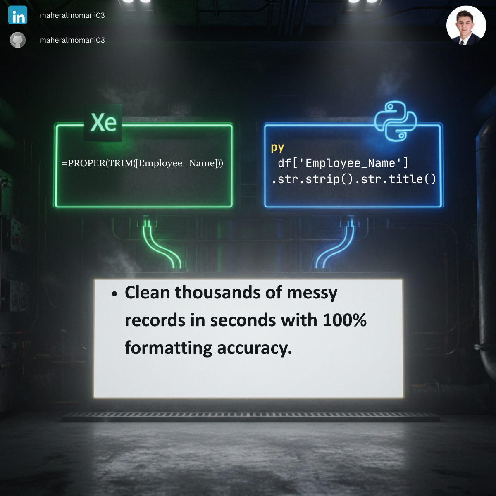

# 🧹 Day 01: Professional Data Cleaning & Formatting

### 🎯 Objective
Standardizing financial datasets by removing inconsistent whitespaces and fixing capitalization errors to ensure data integrity and accurate reporting.

### 💼 Accounting Context
* **Data Reliability:** Consistent formatting prevents duplicate entries and reconciliation errors in sub-ledgers.
* **Audit Trail:** Automated cleaning replaces manual "Find & Replace," providing a replicable and auditable data preparation workflow.

### 📗 Excel Approach
**Formula:**
`=PROPER(Table1[#All])`

**Logic:**
Capitalizes the first letter of each word and converts all other letters to lowercase.

### 🐍 Python Approach
**Logic:**
* `str.strip()`: Removes leading and trailing spaces that cause VLOOKUP errors.
* `str.title()`: Standardizes text casing for professional presentation.

### 📊 Visual Reference
