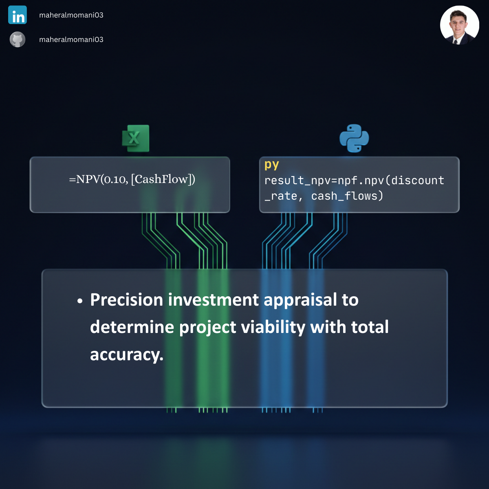

# 💰 Day 05: Net Present Value (NPV) for Investment Appraisal

### 🎯 Objective
Evaluating the profitability of a project or investment by calculating the present value of future cash flows discounted at a specific rate. NPV helps determine if an investment will add value to the organization.

### 💼 Accounting Context
* **Capital Budgeting:** A core tool for deciding between competing long-term investment projects.
* **Time Value of Money (TVM):** Recognizes that a dollar today is worth more than a dollar in the future due to its potential earning capacity.
* **CMA Focus:** NPV is a critical metric in the "Corporate Finance" and "Decision Analysis" sections of the CMA curriculum.

### 📗 Excel Approach
**Formula:**
`=NPV(rate, Year1_CashFlows) + Year0_Initial_Investment`

**Logic:**
Uses the built-in `NPV` function for future cash flows and manually adds the initial outflow (Year 0) to find the net result.

### 🐍 Python Approach
**Logic:**
* **Step-by-Step Calculation:** Python allows for an explicit PV calculation for each year using the formula: $PV = CF / (1 + r)^n$.
* **Data Granularity:** Provides a detailed table showing the discounted value of each individual cash flow before summing them up, offering better transparency for auditors.

### 📊 Visual Reference
