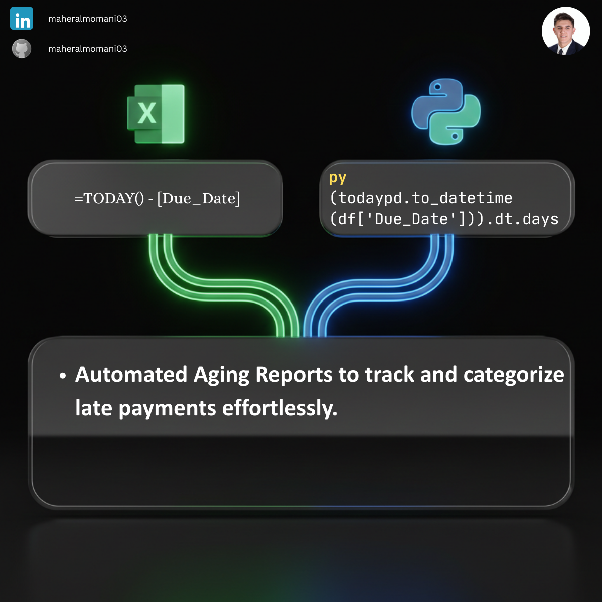

# ⏳ Day 07: Accounts Receivable Aging Report

### 🎯 Objective
Categorizing unpaid customer invoices by the length of time they have been outstanding. This report is vital for identifying slow-paying customers and managing the company's collection process effectively.

### 💼 Accounting Context
* **Liquidity Management:** Helps in forecasting cash inflows and maintaining adequate working capital.
* **Allowance for Doubtful Accounts:** Providing a basis for estimating bad debt expenses according to IFRS/GAAP standards.
* **Credit Risk Assessment:** Monitoring customer payment behavior to adjust credit limits and terms.

### 📗 Excel Approach
**Formula:**
`=TODAY() - Aging_Table[Due_Date]`

**Logic:**
Calculates the net days between the current date and the due date. Accountants then usually use nested `IF` statements or `VLOOKUP` to assign aging buckets (e.g., 0-30, 31-60).

### 🐍 Python Approach
**Logic:**
* **`pd.to_datetime`:** Ensures robust date arithmetic, avoiding errors caused by inconsistent date formats in raw data.
* **`pd.cut` (Binning):** A highly efficient method to categorize thousands of invoices into specific aging "buckets" instantly. This is more scalable and less prone to error than complex Excel formulas.

### 📊 Visual Reference
