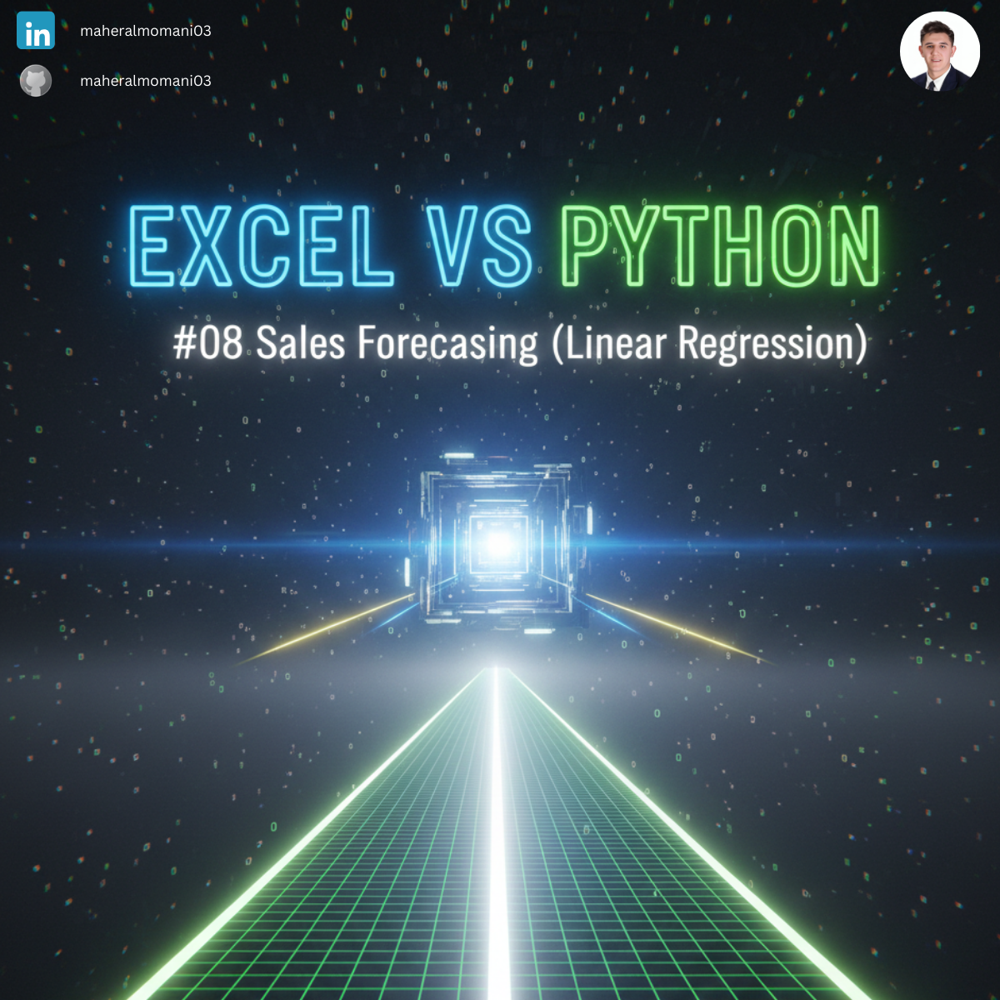
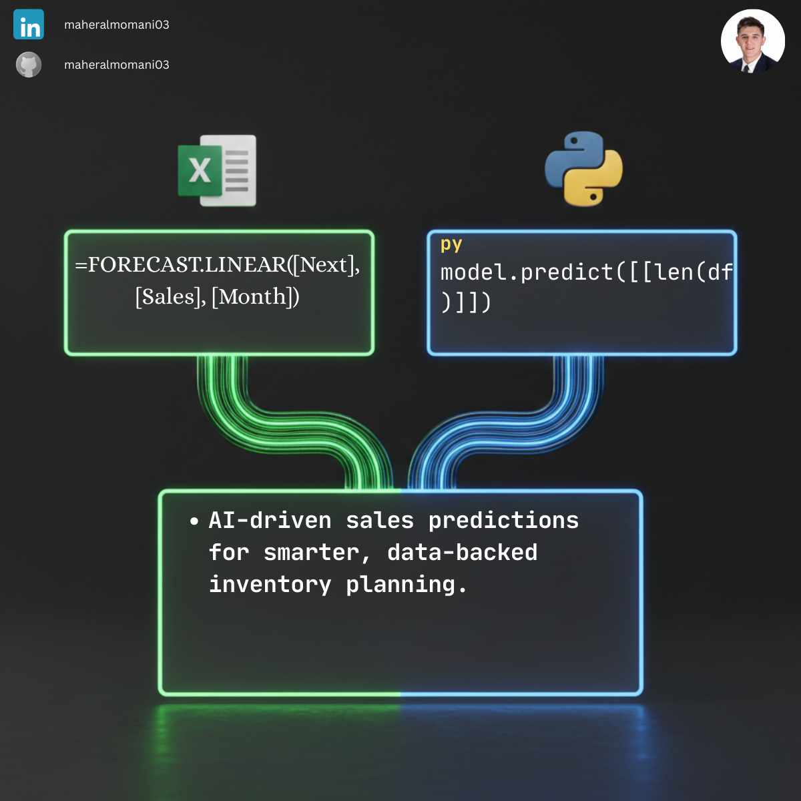

# 📈 Day 08: Sales Forecasting (Linear Regression)

### 🎯 Objective
Utilizing historical data to predict future financial outcomes. Linear regression identifies the trend line in past sales to estimate revenue for upcoming periods, enabling data-driven strategic planning.

### 💼 Accounting Context
* **Budgeting & Planning:** Provides a quantitative basis for setting realistic sales targets and expense budgets.
* **Resource Allocation:** Helps management decide on inventory levels and staffing requirements based on expected demand.
* **Financial Modeling:** A fundamental skill for financial analysts to project long-term company growth and valuation.

### 📗 Excel Approach
**Formula:**
`=FORECAST.LINEAR(7, Forecast_Table[Sales], Forecast_Table[Month])`

**Logic:**
Excel uses the least squares method to calculate the future value along a linear trend based on existing x-values and y-values.

### 🐍 Python Approach
**Logic:**
* **`scikit-learn` Library:** Using a dedicated machine learning library allows for more advanced modeling beyond simple linear trends.
* **Model Fitting:** The `LinearRegression().fit()` function calculates the mathematical relationship between time (months) and revenue (sales).
* **Scalability:** Python can easily handle multiple independent variables (Multi-linear regression) to account for seasonality or economic indicators.

### 📊 Visual Reference
