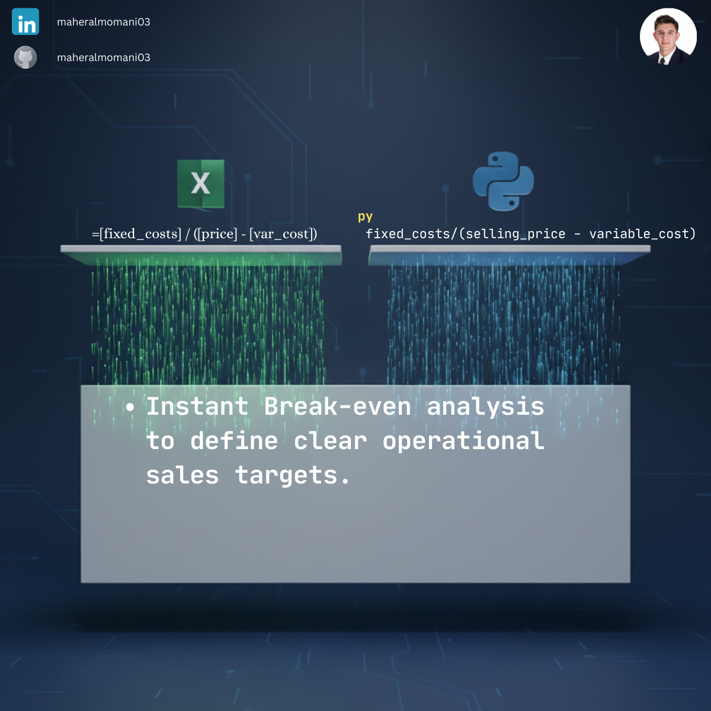

# 📉 Day 10: Cost-Volume-Profit (Break-even Analysis)

### 🎯 Objective
Determining the exact sales volume (in units) required to cover all fixed and variable costs, resulting in zero profit. This analysis is crucial for risk assessment and setting sales targets.

### 💼 Accounting Context
* **CMA Core Concept:** A fundamental part of "Cost Management" and "Decision Analysis" within the CMA curriculum.
* **Contribution Margin:** Focuses on the margin available to cover fixed costs after meeting variable expenses.
* **Margin of Safety:** Provides a baseline to calculate how much sales can drop before the company starts incurring losses.

### 📗 Excel Approach
**Formula:**
`=B2 / (C2 - D2)`

**Logic:**
Directly divides the `Fixed_Cost` by the unit contribution margin (`Selling_Price - Variable_Cost`).

### 🐍 Python Approach
**Logic:**
* **Vectorized Calculation:** Instantly calculates the break-even point for a full product portfolio simultaneously.
* **Data Flexibility:** Python allows for easy "What-if" analysis by adjusting cost parameters across the entire dataset without re-dragging formulas.

### 📊 Visual Reference
