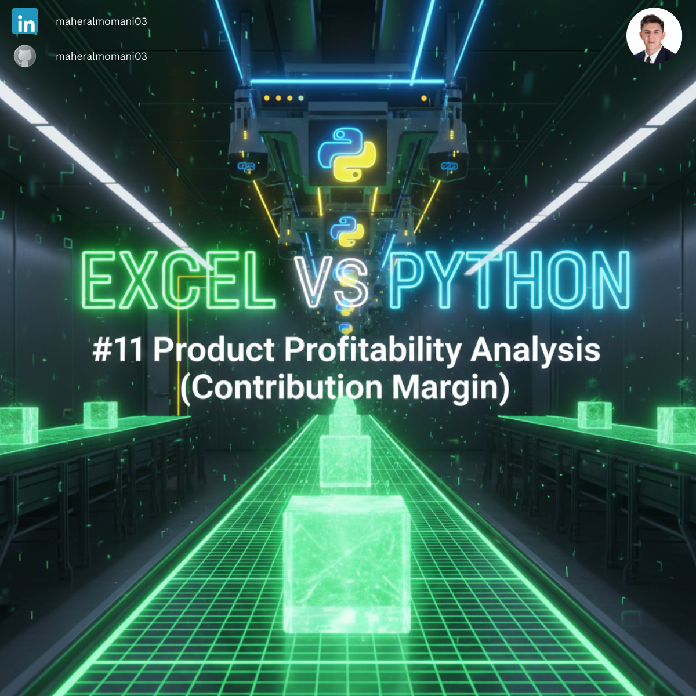
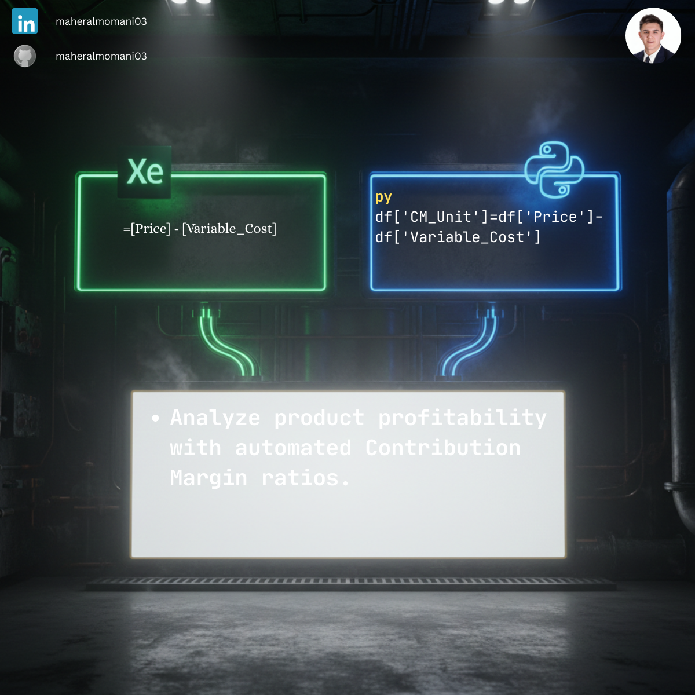

# 💰 Day 11: Product Profitability (Contribution Margin)

### 🎯 Objective
Calculating the Contribution Margin per unit to determine how each product contributes to covering fixed costs and generating profit.

### 💼 Accounting Context
* **CMA Focus:** Understanding the relationship between cost, volume, and profit (CVP analysis).
* **Decision Making:** Identifying high-margin products to prioritize in marketing and sales strategies.

### 📗 Excel Approach
**Formula:** `=B2 - C2`
**Logic:** Subtracting Unit Variable Cost from Selling Price.

### 🐍 Python Approach
**Logic:** Vectorized calculation across the entire product portfolio using Pandas for instant margin analysis.

### 📊 Visual Reference
