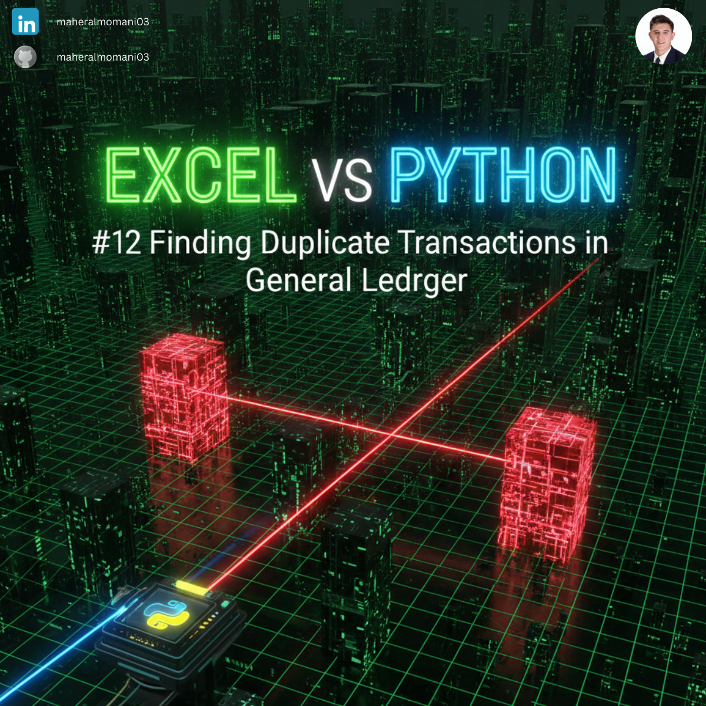
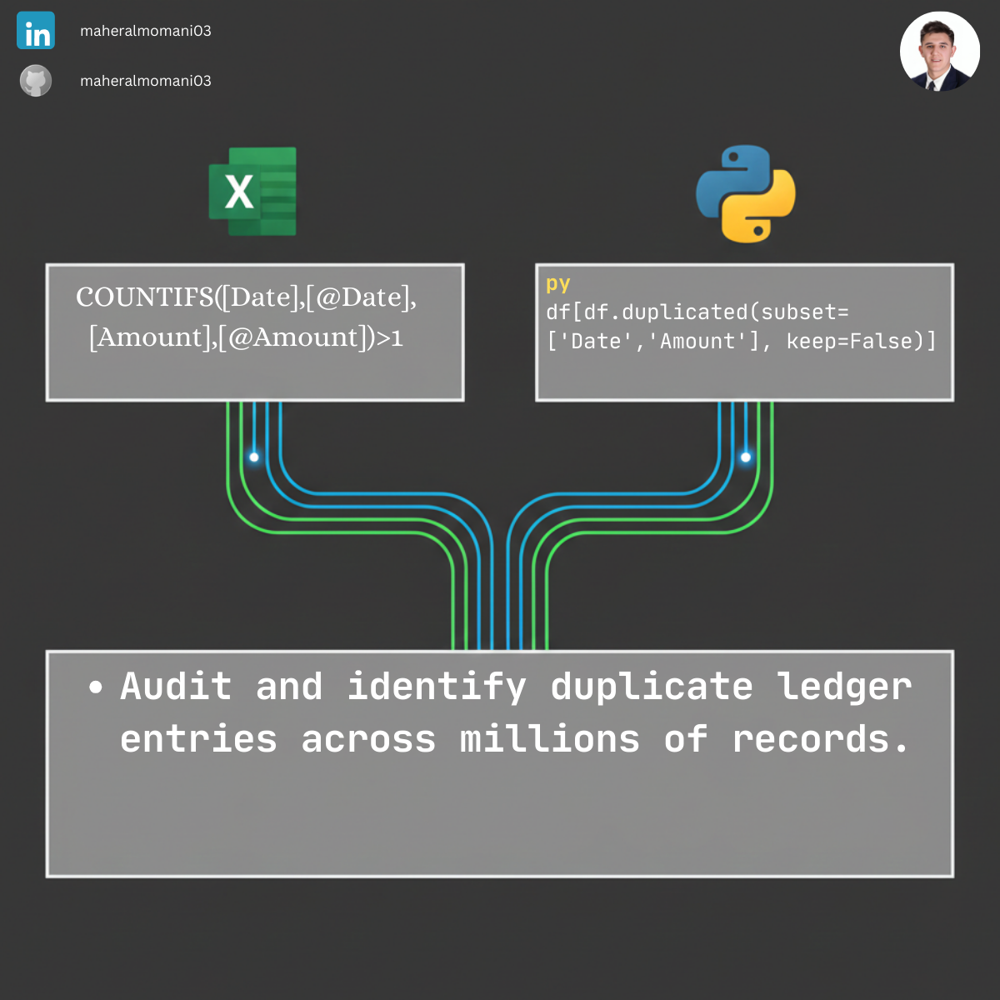

# 🔍 Day 12: Detecting Duplicate Transactions in General Ledger

### 🎯 Objective
Automating the audit process to identify potential duplicate entries in the General Ledger, which could indicate human error or fraudulent activity.

### 💼 Accounting Context
* **Internal Control:** Strengthening the "Control Activities" component of the COSO framework.
* **Audit Efficiency:** Replacing manual row-by-row checks with automated detection logic.

### 📗 Excel Approach
**Formula:** `=COUNTIFS(A:A, A2, B:B, B2) > 1`
**Logic:** Counting occurrences based on multiple criteria (Date and Amount).

### 🐍 Python Approach
**Logic:** Using `df.duplicated()` to identify all redundant records across large datasets instantly.

### 📊 Visual Reference
