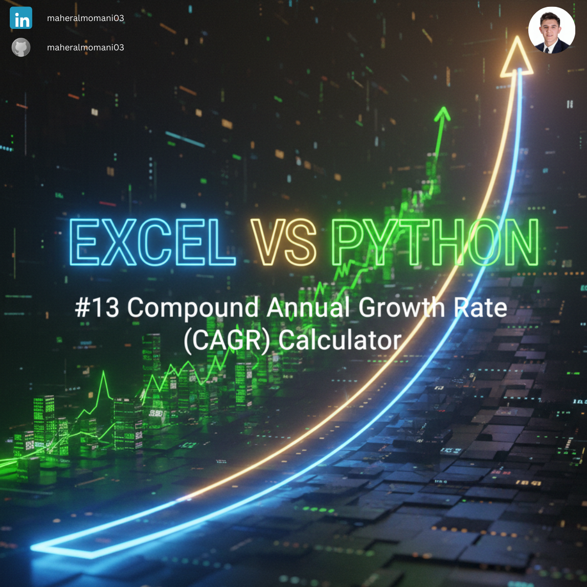
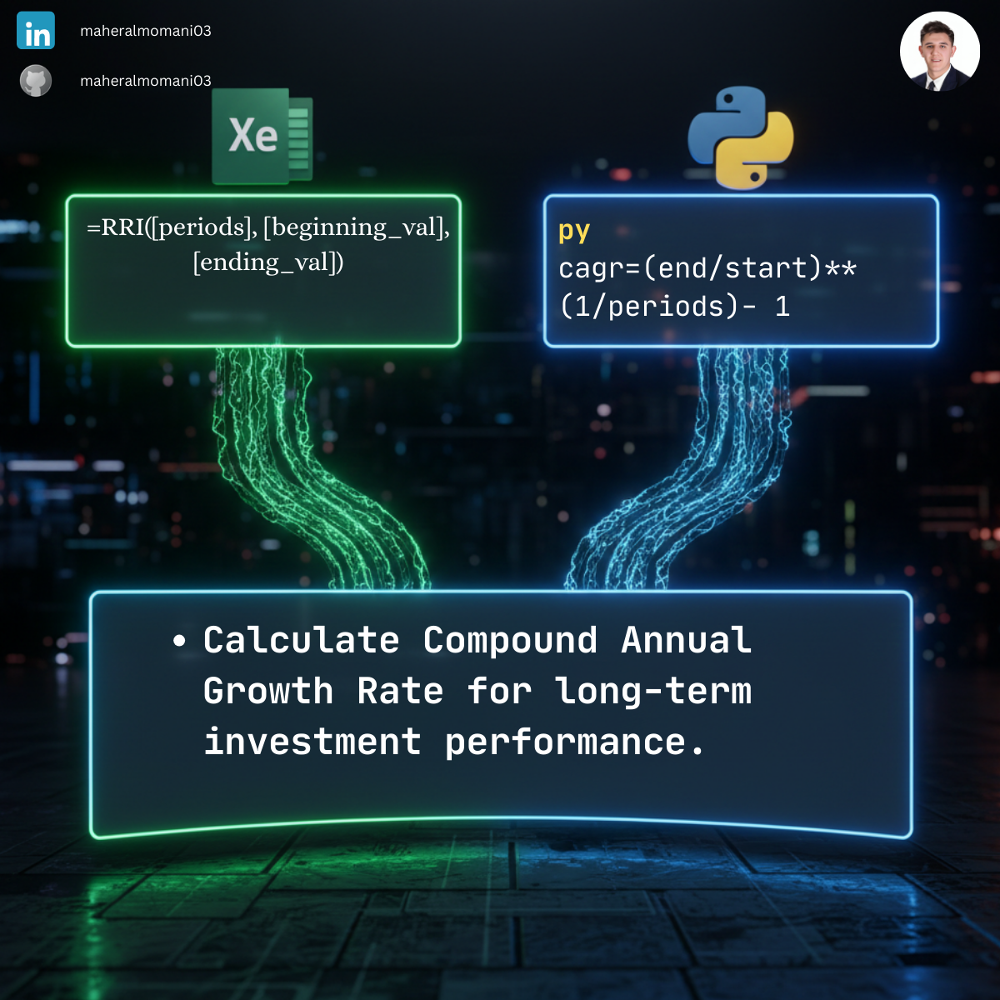

# 📈 Day 13: Compound Annual Growth Rate (CAGR)

### 🎯 Objective
Measuring the mean annual growth rate of an investment over a specified period longer than one year.

### 💼 Accounting Context
* **Financial Analysis:** Comparing the performance of different investment opportunities on a level playing field.
* **Performance Reporting:** Smoothing out returns to understand long-term growth trends.

### 📗 Excel Approach
**Formula:** `=RRI(5, B2, B7)`
**Logic:** Using the built-in RRI function to find the equivalent interest rate for an investment's growth.

### 🐍 Python Approach
**Logic:** Implementing the mathematical formula: $CAGR = (\frac{Ending Value}{Beginning Value})^{\frac{1}{n}} - 1$.

### 📊 Visual Reference
