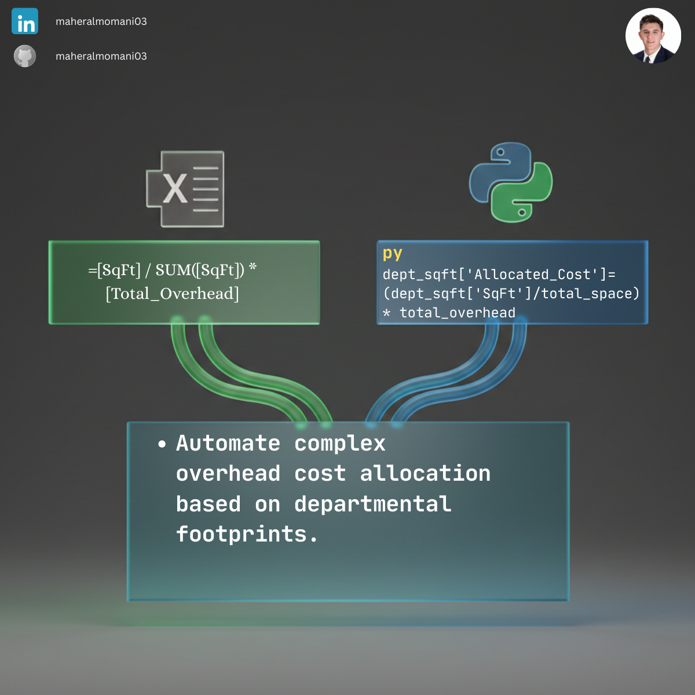

# 🏭 Day 14: Automated Overhead Cost Allocation

### 🎯 Objective
Allocating indirect costs (Overhead) to different departments based on a specific cost driver, such as square footage.

### 💼 Accounting Context
* **Cost Accounting:** Essential for accurate product costing and departmental performance evaluation.
* **CMA Concept:** Understanding "Cost Objects" and "Allocation Bases" for effective cost management.

### 📗 Excel Approach
**Formula:** `=[@SqFt] / SUM([SqFt]) * [@Total_Overhead]`
**Logic:** Proportional allocation based on the department's share of total area.

### 🐍 Python Approach
**Logic:** Automated proportioning across all departments using vectorized math, eliminating the risk of broken SUM references.

### 📊 Visual Reference
