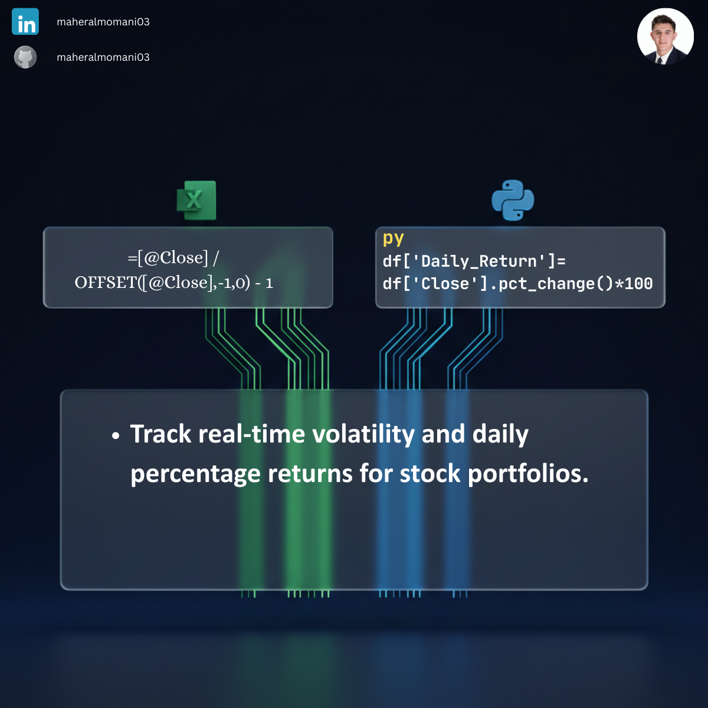

# 🏎️ Day 15: Real-time Stock Performance (Tesla Project)

### 🎯 Objective
Calculating daily percentage returns for stock prices to monitor market volatility and investment performance.

### 💼 Accounting Context
* **Financial Management:** Monitoring marketable securities and evaluating investment risk.
* **Portfolio Valuation:** Real-time updates for fair value adjustments in financial statements.

### 📗 Excel Approach
**Formula:** `=(B3 / B2) - 1`
**Logic:** Comparing current day's closing price against the previous day.

### 🐍 Python Approach
**Logic:** Using `.pct_change()` to instantly calculate daily returns for historical datasets, including handling null values.

### 📊 Visual Reference
