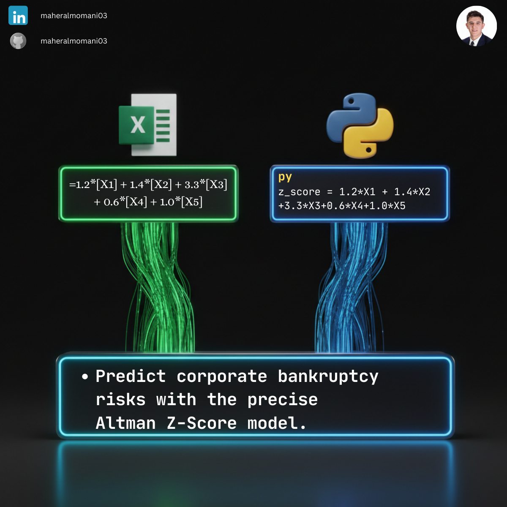

# 📉 Day 16: Altman Z-Score Calculation

### 🎯 Objective
Predicting the probability that a firm will go into bankruptcy within two years.

### 💼 Accounting Context
* **Financial Distress:** A key metric for credit analysts and auditors to assess "Going Concern" risk.
* **CMA Topic:** Essential for Corporate Finance and Risk Management modules.

### 📗 Excel Approach
**Formula:** `=1.2*B2 + 1.4*C2 + 3.3*D2 + 0.6*E2 + 1*F2`

### 🐍 Python Approach
**Logic:** Using vectorized operations to calculate Z-Scores for entire portfolios instantly, with automated column cleaning to prevent calculation errors.

### 📊 Visual Reference
