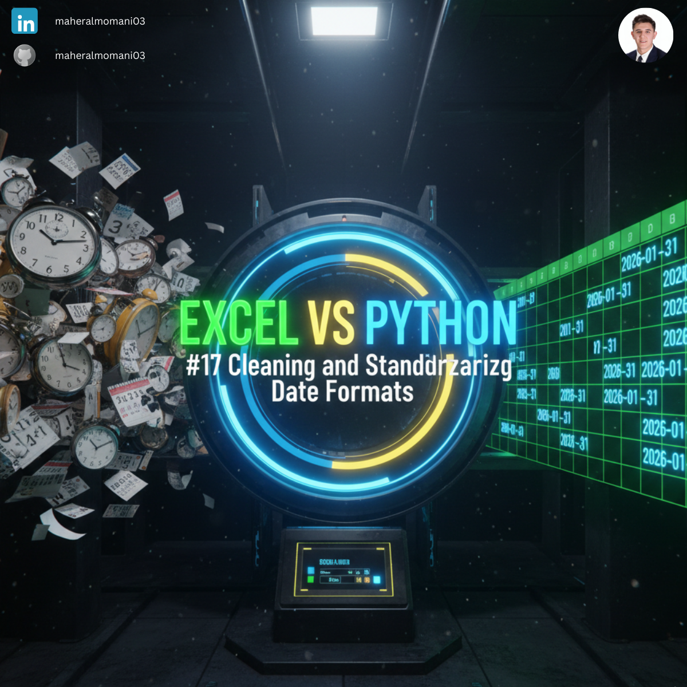
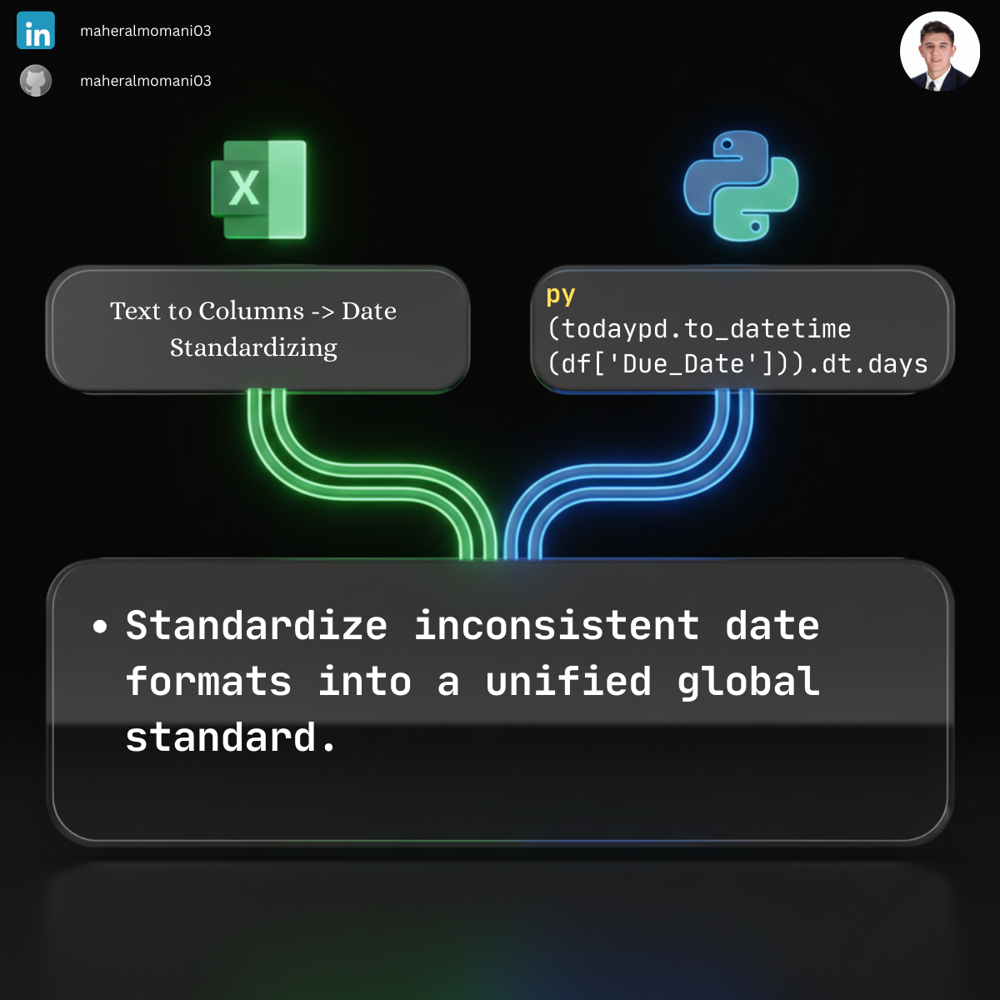

# 📅 Day 17: Cleaning and Standardizing Date Formats

### 🎯 Objective
Transforming inconsistent date entries into a unified, system-ready format for chronological financial analysis.

### 💼 Accounting Context
* **Data Integrity:** Vital for aging reports, interest calculations, and period-end closings.
* **Automation:** Prevents errors during ERP system uploads.

### 📗 Excel Approach
**Tool:** Data > Text to Columns (Manual cleaning through wizard steps).

### 🐍 Python Approach
**Logic:** `pd.to_datetime` with `errors='coerce'` intelligently parses various date formats and handles invalid entries automatically.

### 📊 Visual Reference
