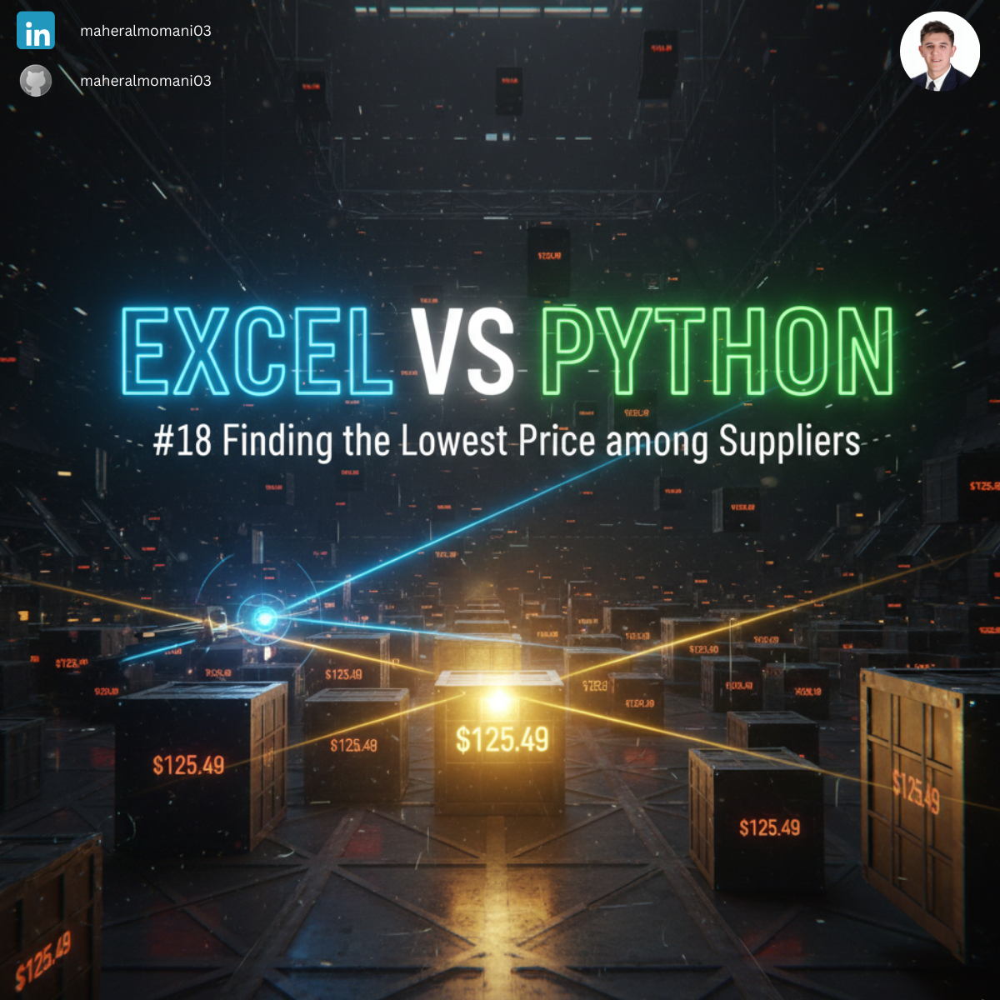
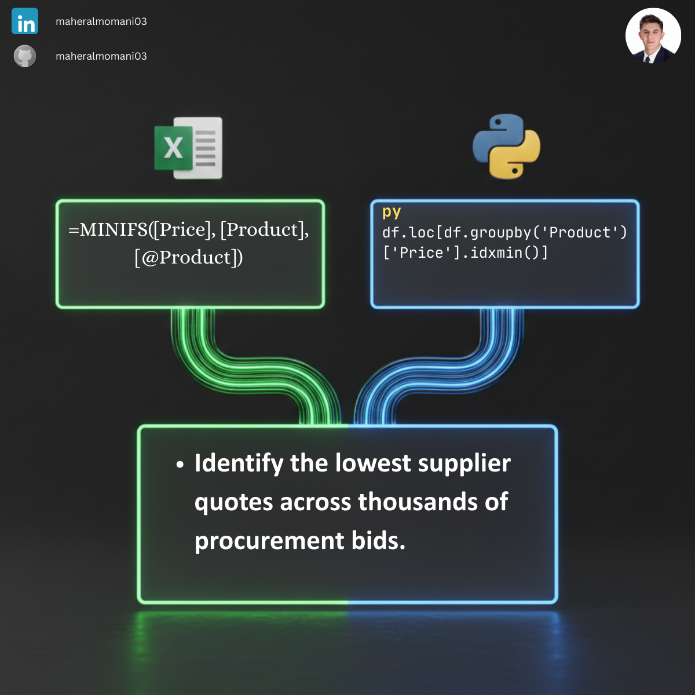

# 🏷️ Day 18: Finding the Lowest Price among Suppliers

### 🎯 Objective
Identifying the most cost-effective supplier for each product category within a large procurement database.

### 💼 Accounting Context
* **Cost Reduction:** Direct impact on COGS and Gross Margin optimization.
* **Supply Chain Audit:** Verifying that procurement teams are sourcing from the lowest-priced approved vendors.

### 📗 Excel Approach
**Formula:** `=MINIFS(Price_Table[Price], Price_Table[Product], Price_Table[@Product])`

### 🐍 Python Approach
**Logic:** Combining `groupby` and `idxmin` to return not just the minimum price, but the entire record (including the supplier name) in one step.

### 📊 Visual Reference
