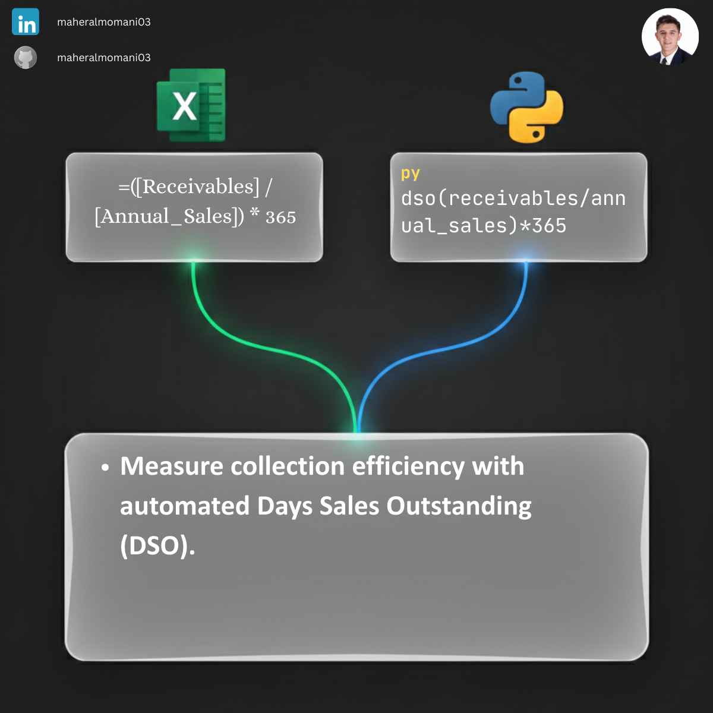

# 💳 Day 19: Days Sales Outstanding (DSO) Calculation

### 🎯 Objective
Measuring the average number of days it takes for a company to collect payment after a sale has been made.

### 💼 Accounting Context
* **Liquidity Analysis:** A high DSO indicates poor collection procedures and potential cash flow issues.
* **CMA Performance Metric:** Key part of working capital management and financial ratio analysis.

### 📗 Excel Approach
**Formula:** `=DSO_Table[@Receivables] / DSO_Table[@Annual_Sales] * 365`

### 🐍 Python Approach
**Logic:** Scalable ratio calculation across thousands of customer accounts to monitor collection efficiency trends.

### 📊 Visual Reference
