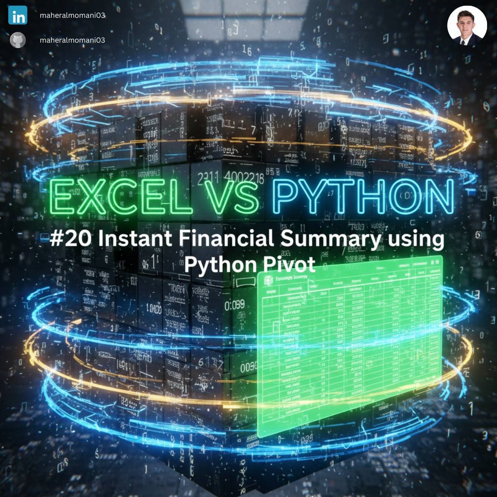
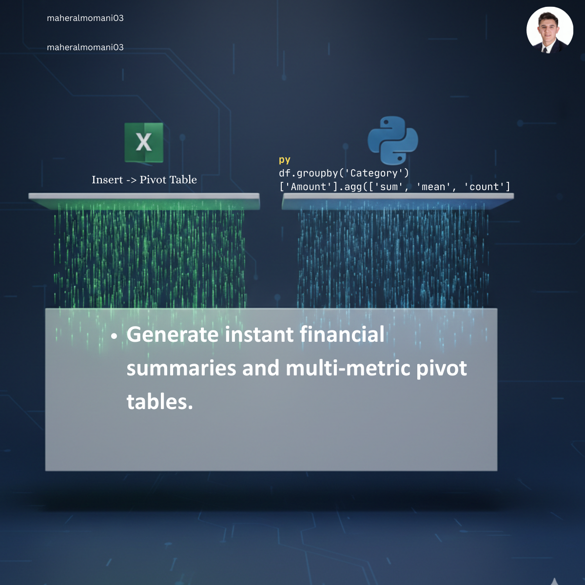

# 📊 Day 20: Instant Financial Summary (Python Pivot)

### 🎯 Objective
Summarizing large volumes of transaction data into meaningful insights using pivot-table logic.

### 💼 Accounting Context
* **Management Reporting:** Quick summaries of expenses by category for budget meetings.
* **Data Exploration:** Instantly calculating Sum, Average, and Count to verify data completeness.

### 📗 Excel Approach
**Tool:** Insert > Pivot Table (Manual creation and formatting).

### 🐍 Python Approach
**Logic:** Using `groupby` with `.agg()` to generate multi-metric reports programmatically, ensuring the report is easily refreshable without manual formatting.

### 📊 Visual Reference
