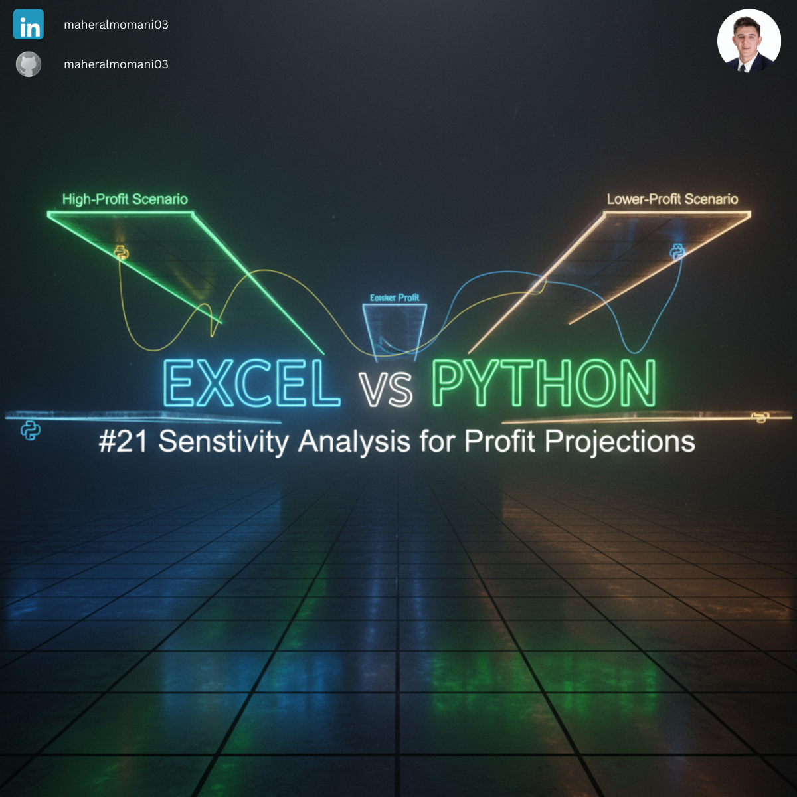
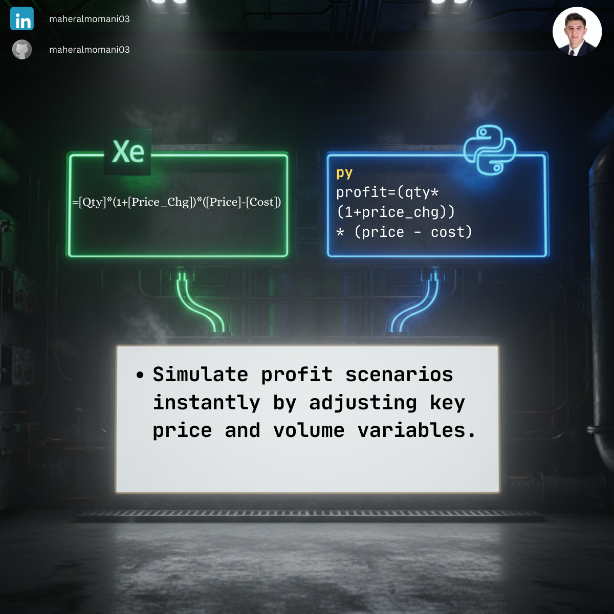

# 📉 Day 21: Sensitivity Analysis for Profit Projections

### 🎯 Objective
Performing a "What-if" analysis to predict how changes in selling price impact total profit projections. This help management understand the sensitivity of the bottom line to market pricing fluctuations.

### 💼 Accounting Context
* **Risk Management:** Quantifying the potential impact of price volatility on project feasibility.
* **CMA Topic:** Directly related to "Decision Analysis" and "Marginal Analysis" for short-term decision making.
* **Strategic Planning:** Assisting the sales department in determining the optimal discount levels without compromising target profit.

### 📗 Excel Approach
**Formula:**
`=Scenario_Table[@Qty]*(1+Scenario_Table[@[Price_Chg]])*(Scenario_Table[@Price]-Scenario_Table[@Cost])`

**Logic:**
Multiplies the adjusted quantity by the unit contribution margin for each scenario.

### 🐍 Python Approach
**Logic:**
* **Automation:** Python calculates all scenarios instantly using vectorized math, which is less prone to "reference errors" than dragging complex Excel formulas.
* **Scalability:** Easily handles thousands of scenarios (e.g., Monte Carlo simulations) that would make Excel slow or unresponsive.

### 📊 Visual Reference
