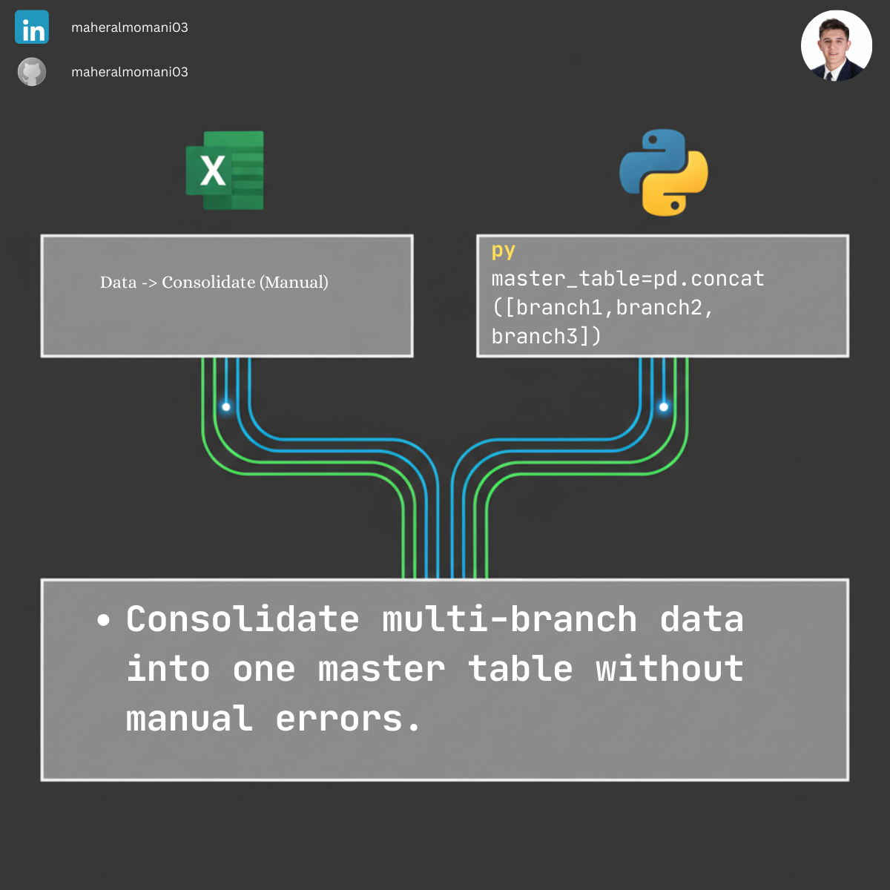

# 🔗 Day 22: Merging Data from Multiple Sheets (Consolidation)

### 🎯 Objective
Automating the consolidation of financial data from different branches or departments into a single master table. This eliminates manual copy-pasting and ensures data consistency across the organization.

### 💼 Accounting Context
* **Financial Consolidation:** Vital for group reporting where data arrives in separate files or sheets from different subsidiaries.
* **Internal Control:** Reduces the risk of human error associated with manual data aggregation (Copy/Paste).
* **Reporting Efficiency:** Drastically cuts down the time required for period-end closings.

### 📗 Excel Approach
**Logic:**
Usually involves manual copy-pasting or using Power Query (Append) to stack tables on top of each other.

### 🐍 Python Approach
**Logic:**
* **`pd.concat()`:** A powerful function that "stacks" multiple DataFrames vertically. It is dynamic; if a new branch is added, you just add it to the list.
* **`ignore_index=True`:** Ensures the master table has a clean, continuous row numbering for audit purposes.

### 📊 Visual Reference
