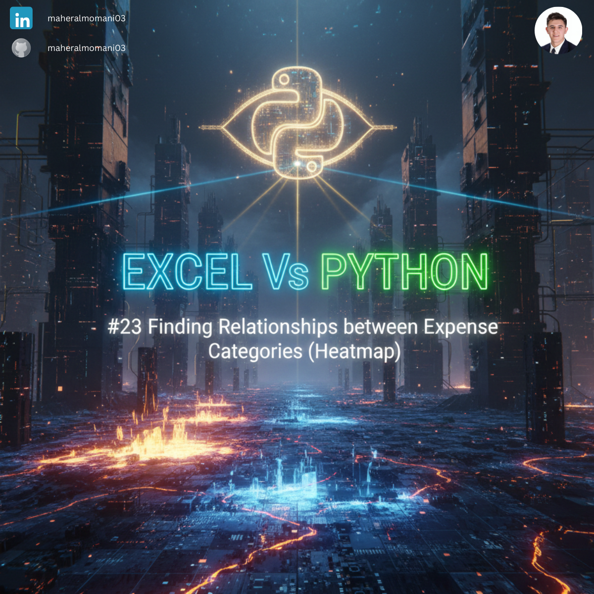

# 🌡️ Day 23: Finding Relationships between Expense Categories (Heatmap)

### 🎯 Objective
Identifying statistical correlations between different expense categories (e.g., Revenue vs. Marketing) to understand how spending in one area affects another.

### 💼 Accounting Context
* **Cost Behavior Analysis:** Understanding how variable costs correlate with revenue growth.
* **Internal Audit:** Detecting unusual patterns where expenses should be correlated but are not.

### 📗 Excel Approach
**Formula:** `=CORREL(A2:A6, B2:B6)`
**Logic:** Calculates the correlation coefficient between two specific arrays.

### 🐍 Python Approach
**Logic:** Using `seaborn.heatmap` to visualize the entire correlation matrix at once, making it easier to spot trends across all departments simultaneously.

### 📊 Visual Reference
