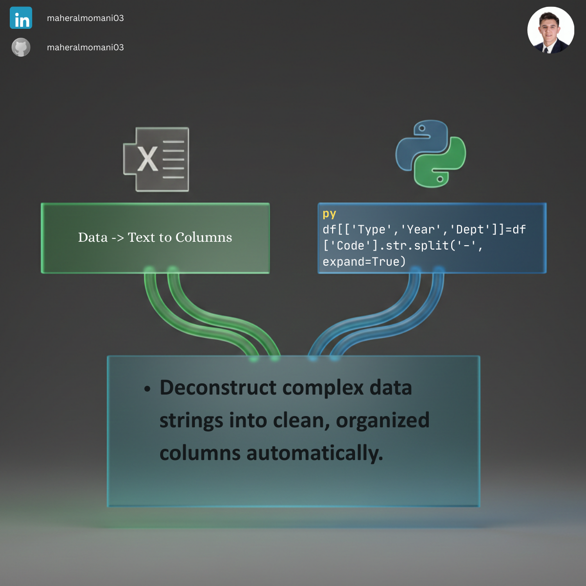

# ✂️ Day 24: Splitting Complex Strings (ID-Date-Category)

### 🎯 Objective
Breaking down unified identification codes into structured data fields for easier filtering and departmental reporting.

### 💼 Accounting Context
* **Data Standardization:** Converting messy legacy system IDs into clean, multi-dimensional attributes.
* **Master Data Management:** Essential for creating clean sub-ledgers from raw exports.

### 📗 Excel Approach
**Tool:** Data > Text to Columns (Delimited by hyphen).

### 🐍 Python Approach
**Logic:** `str.split(expand=True)` creates new columns dynamically, ensuring the original data remains intact for auditing.

### 📊 Visual Reference
