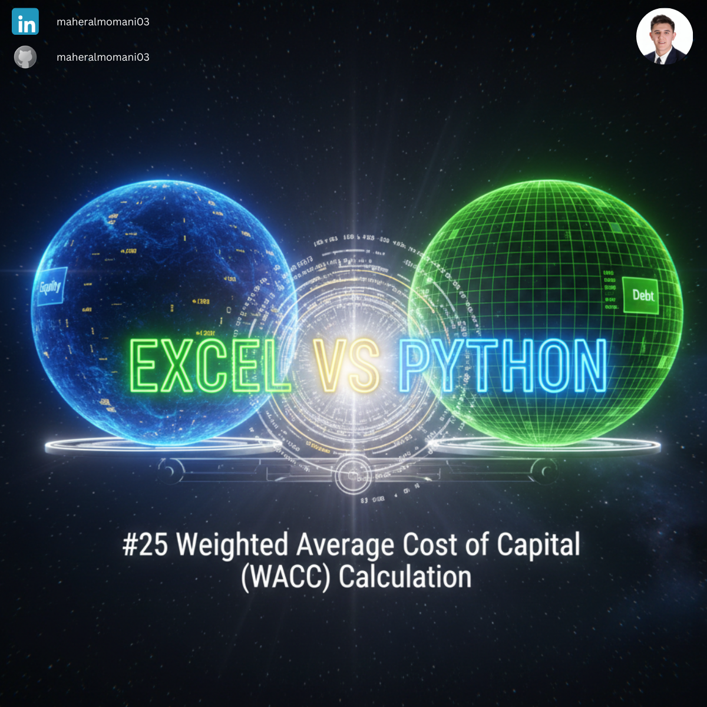
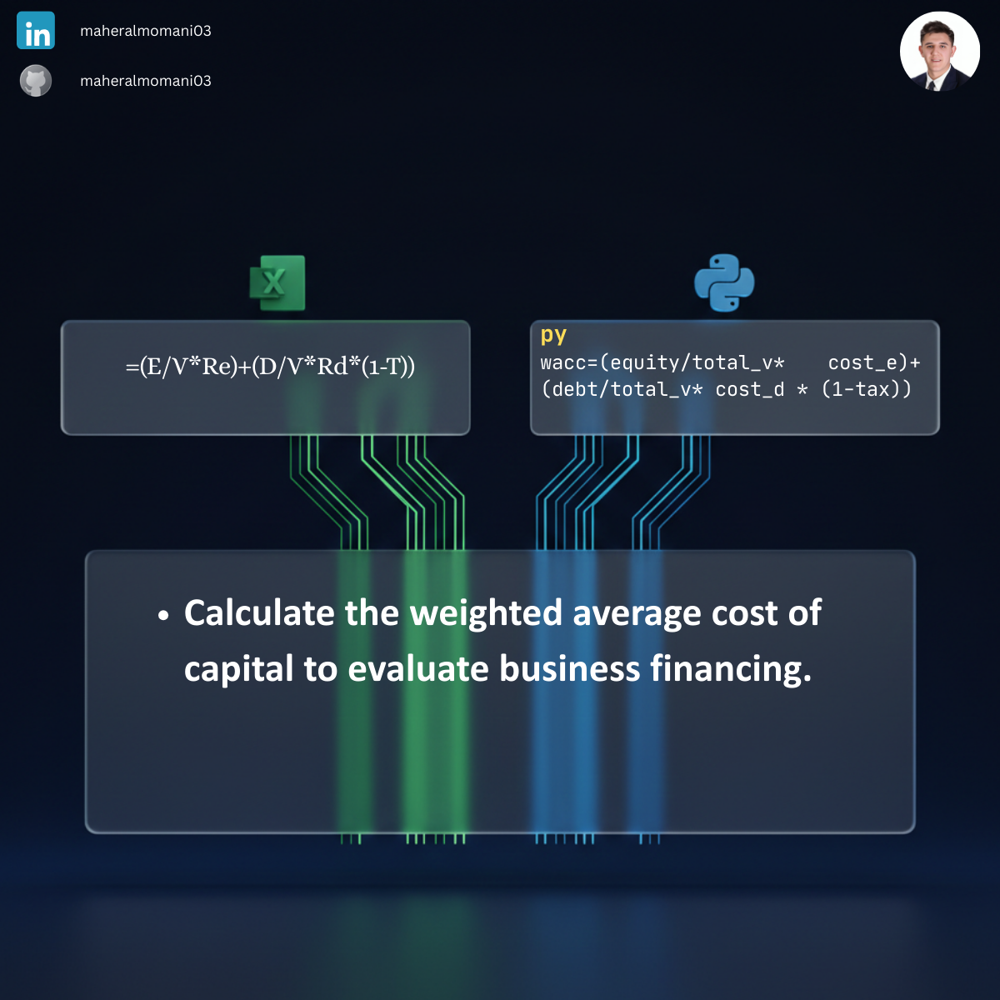

# ⚖️ Day 25: Weighted Average Cost of Capital (WACC) Calculation

### 🎯 Objective
Determining the firm's cost of financing its assets from both debt and equity sources.

### 💼 Accounting Context
* **Corporate Finance (CMA):** A fundamental metric for investment appraisal and firm valuation.
* **Hurdle Rate:** Used as the minimum acceptable return on new capital projects.

### 📗 Excel Approach
**Formula:** `=(A2/(A2+B2)*C2)+(B2/(A2+B2)*D2*(1-E2))`

### 🐍 Python Approach
**Logic:** Step-by-step ratio calculation that improves transparency for financial modeling and reduces algebraic errors.

### 📊 Visual Reference
