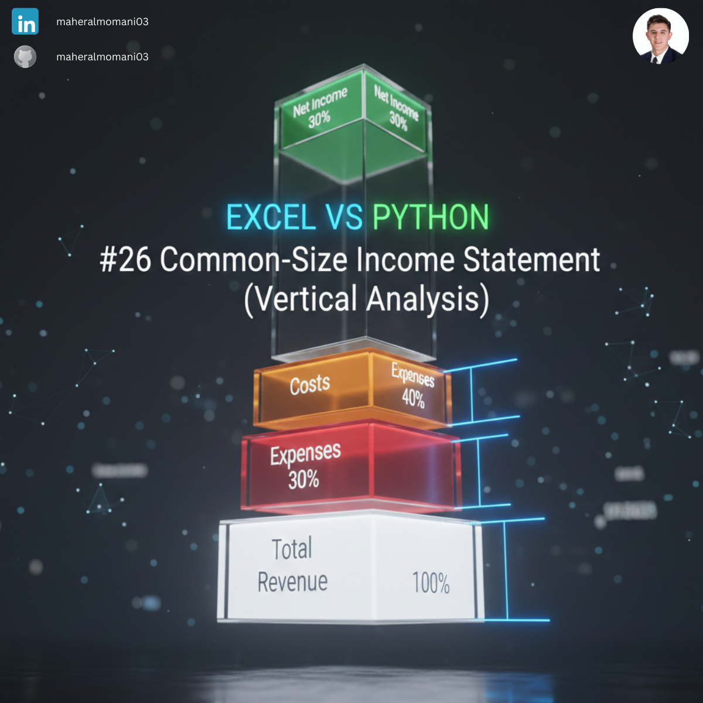
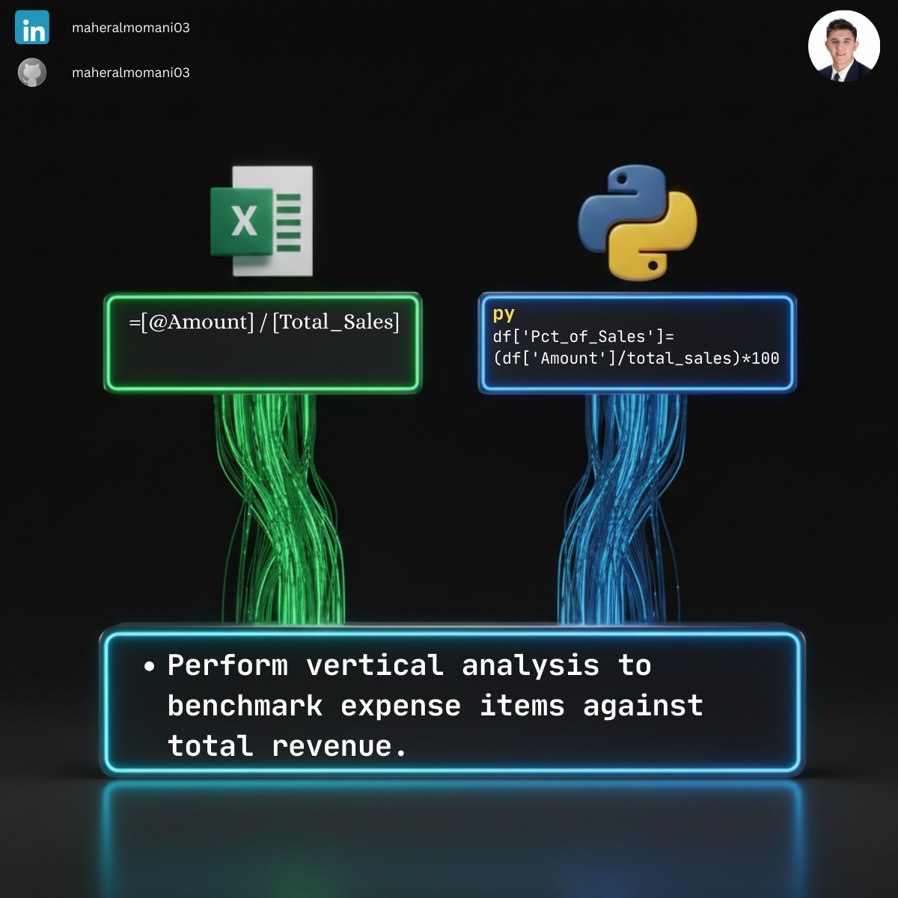

# 📑 Day 26: Common-Size Income Statement (Vertical Analysis)

### 🎯 Objective
Expressing each line item on the income statement as a percentage of total sales to identify structural trends.

### 💼 Accounting Context
* **Trend Analysis:** Comparing companies of different sizes or tracking efficiency over time.
* **CMA Topic:** Core part of financial statement analysis.

### 📗 Excel Approach
**Formula:** `=B3 / $B$2`

### 🐍 Python Approach
**Logic:** Automated vertical analysis using column division, which is easier to scale across multiple years.

### 📊 Visual Reference
