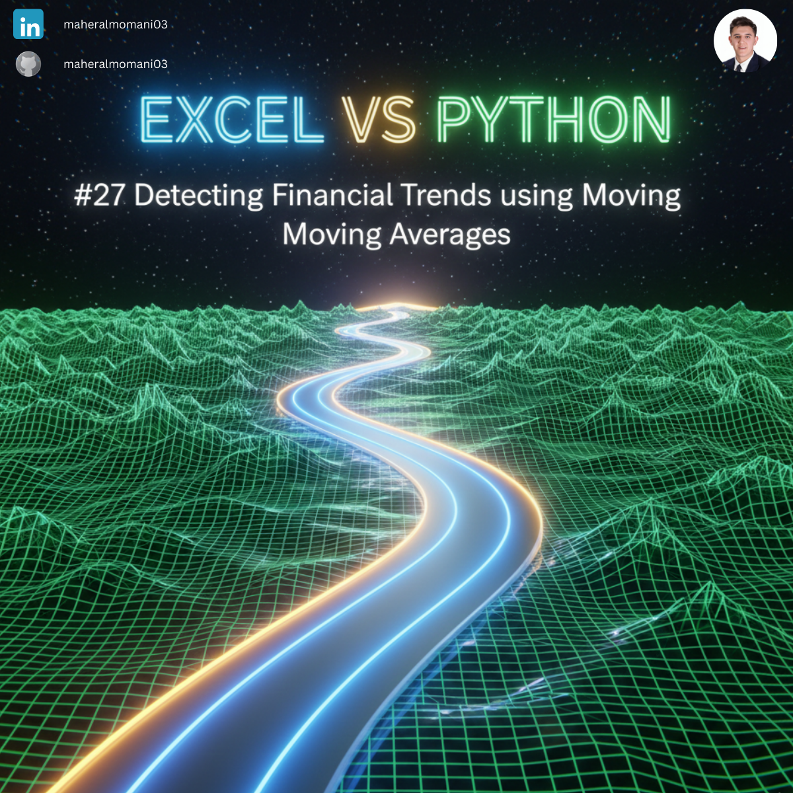
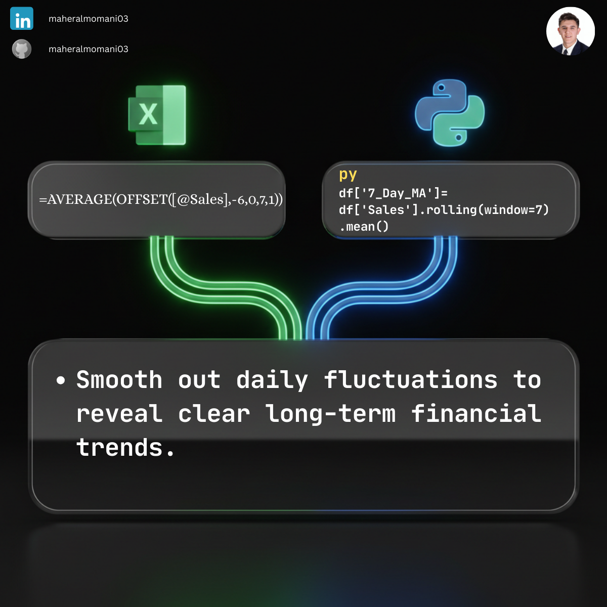

# 📉 Day 27: Detecting Financial Trends (Moving Averages)

### 🎯 Objective
Smoothing out short-term fluctuations in financial data to highlight longer-term trends or cycles.

### 💼 Accounting Context
* **Revenue Forecasting:** Identifying underlying growth trends by removing daily noise.
* **Inventory Planning:** Adjusting stock levels based on smoothed demand patterns.

### 📗 Excel Approach
**Formula:** `=AVERAGE(B2:B8)`

### 🐍 Python Approach
**Logic:** Using `.rolling(window=7).mean()` for dynamic, scalable time-series analysis.

### 📊 Visual Reference
