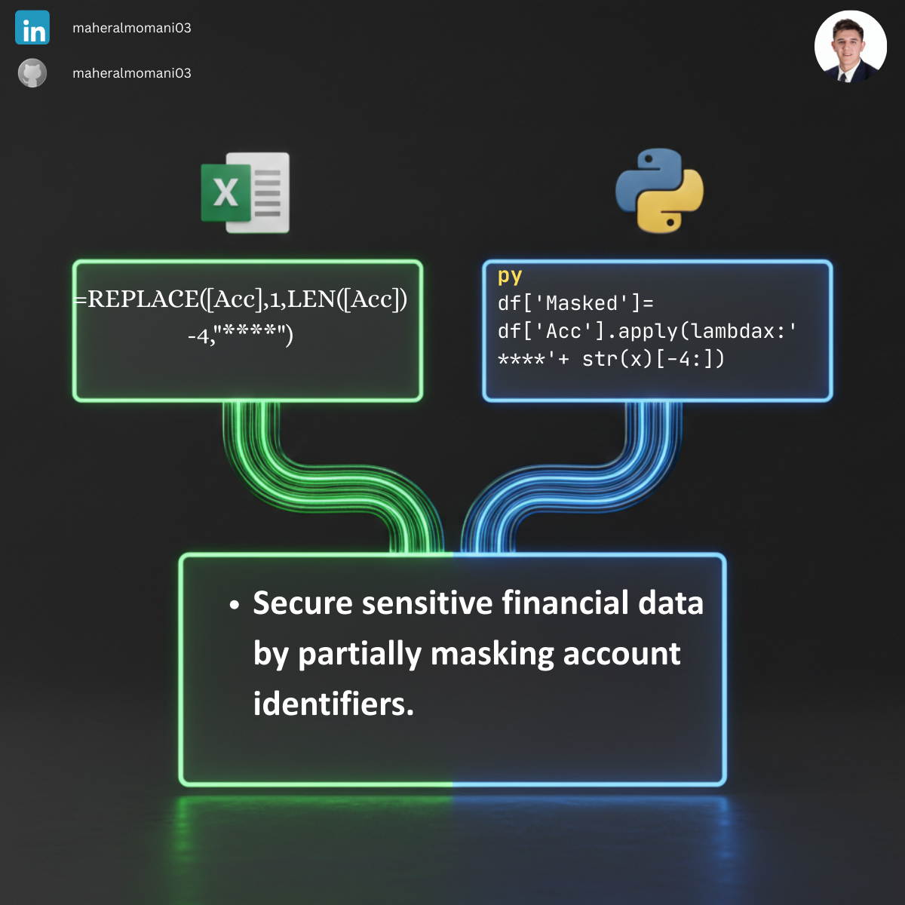

# 🔒 Day 28: Masking Sensitive Data (Account Numbers)

### 🎯 Objective
Securing sensitive financial identifiers by masking the majority of the characters, ensuring that only necessary portions are visible for internal verification purposes.

### 💼 Accounting Context
* **Data Privacy:** Essential for compliance with regulations like GDPR or SOC2 when handling customer or employee banking details.
* **Internal Control:** Reducing the risk of unauthorized access to full bank account numbers within financial reports.

### 📗 Excel Approach
**Formula:**
`=REPLACE(A2, 1, LEN(A2)-4, "****")`

**Logic:**
Replaces all characters except the last four with a masking string ("****").

### 🐍 Python Approach
**Logic:**
* **`apply(lambda)`:** A flexible way to transform each record. It converts the number to a string and concatenates the mask with a "slice" of the last 4 digits `[-4:]`.
* **Robustness:** Python handles large datasets significantly faster than Excel's text manipulation functions.

### 📊 Visual Reference
