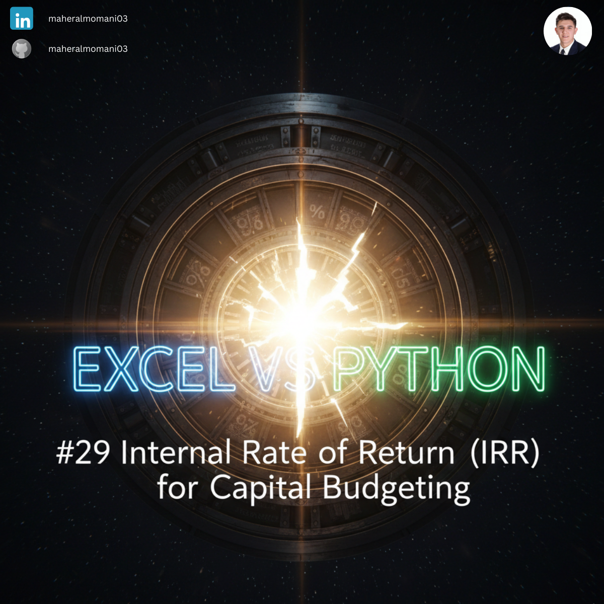
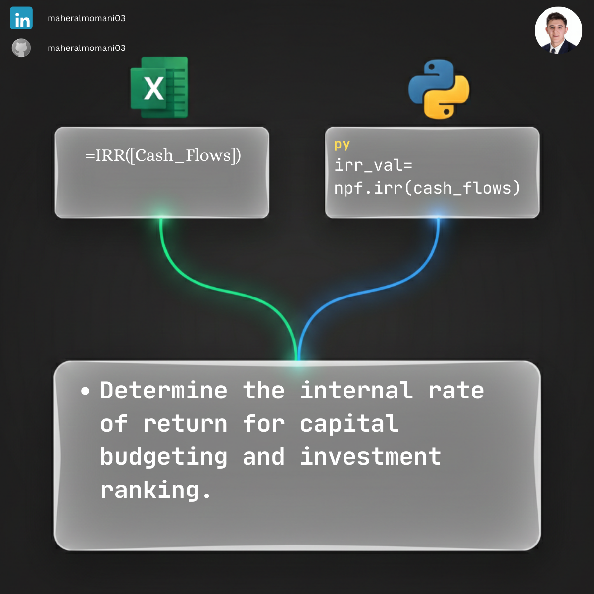

# 💰 Day 29: Internal Rate of Return (IRR) for Capital Budgeting

### 🎯 Objective
Calculating the discount rate that makes the net present value (NPV) of all cash flows from a particular project equal to zero. IRR is a critical metric for evaluating the profitability and efficiency of capital investments.

### 💼 Accounting Context
* **Investment Appraisal:** A core tool used to decide whether to proceed with a project; if the IRR is higher than the required rate of return, the project is considered viable.
* **CMA Focus:** A fundamental concept in the "Decision Analysis" and "Corporate Finance" sections of the CMA curriculum.
* **Comparison Tool:** Allows financial managers to compare the potential returns of multiple projects with different timelines and cash flow patterns.

### 📗 Excel Approach
**Formula:**
`=IRR(A2:A6)`

**Logic:**
Excel uses an iterative process to find the percentage that satisfies the NPV=0 condition. It is straightforward but can sometimes struggle with non-conventional cash flows.

### 🐍 Python Approach
**Logic:**
* **`scipy.optimize`:** We utilized the `fsolve` algorithm to solve the mathematical root of the NPV equation. This method is highly robust for financial modeling.
* **Advanced Data Cleaning:** Unlike standard formulas, our Python script includes a custom cleaning function to handle real-world data issues, such as converting trailing signs (e.g., `100000-`) into proper negative numbers.
* **Accuracy:** Provides results identical to Excel while offering greater transparency in the calculation steps for audit purposes.

### 📊 Visual Reference
