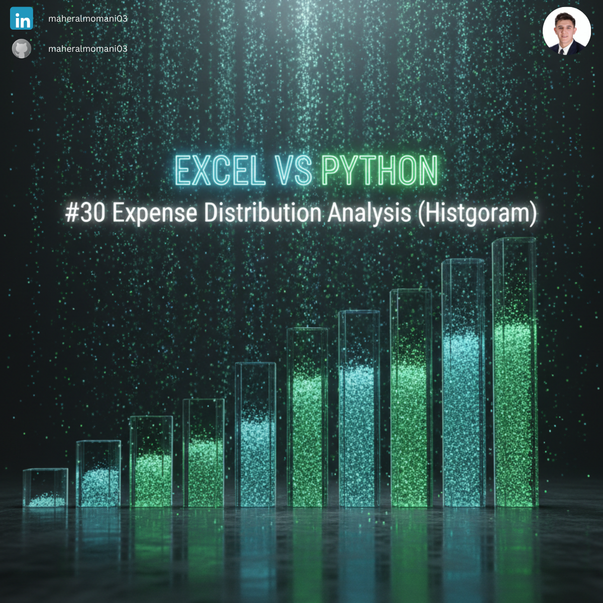
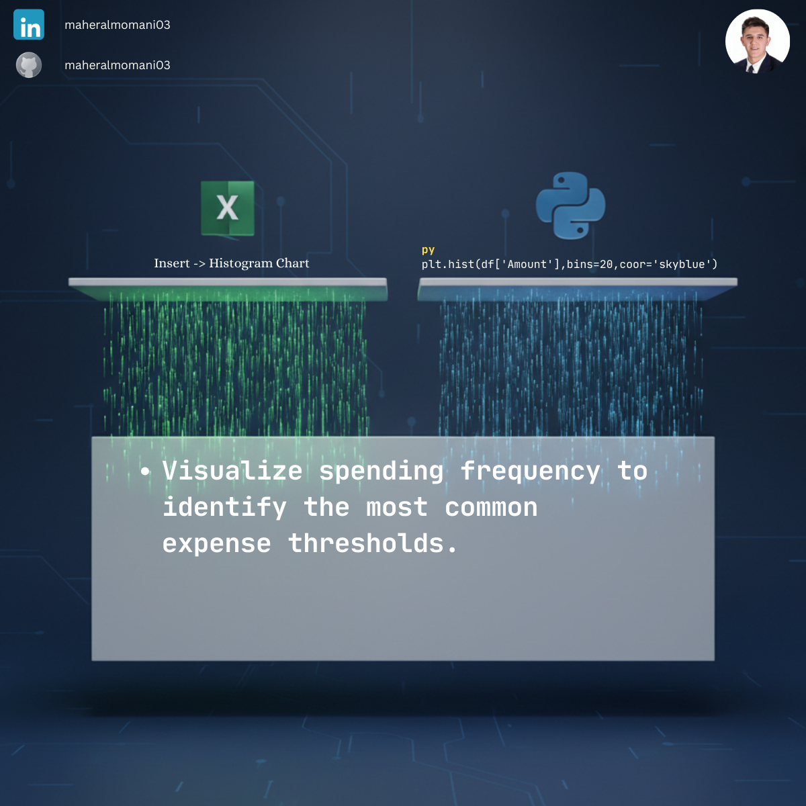

# 📊 Day 30: Expense Distribution Analysis (Histogram)

### 🎯 Objective
Analyzing the frequency distribution of financial transactions to identify the most common spending ranges and detect outliers.

### 💼 Accounting Context
* **Auditing:** Identifying unusual transaction clusters that may require closer investigation.
* **Cost Management:** Understanding the "Spread" of expenses to optimize procurement strategies.

### 📗 Excel Approach
**Tool:**
Insert > Statistic Chart > Histogram.

**Logic:**
Excel automatically bins the data into ranges to show the count of occurrences in each bucket.

### 🐍 Python Approach
**Logic:**
* **`plt.hist()`:** Provides granular control over the number of "bins" and visual styling, making the distribution clearer for executive presentations.
* **Statistical Insight:** Easily integrates with other statistical functions to calculate skewness or kurtosis of financial data.

### 📊 Visual Reference
