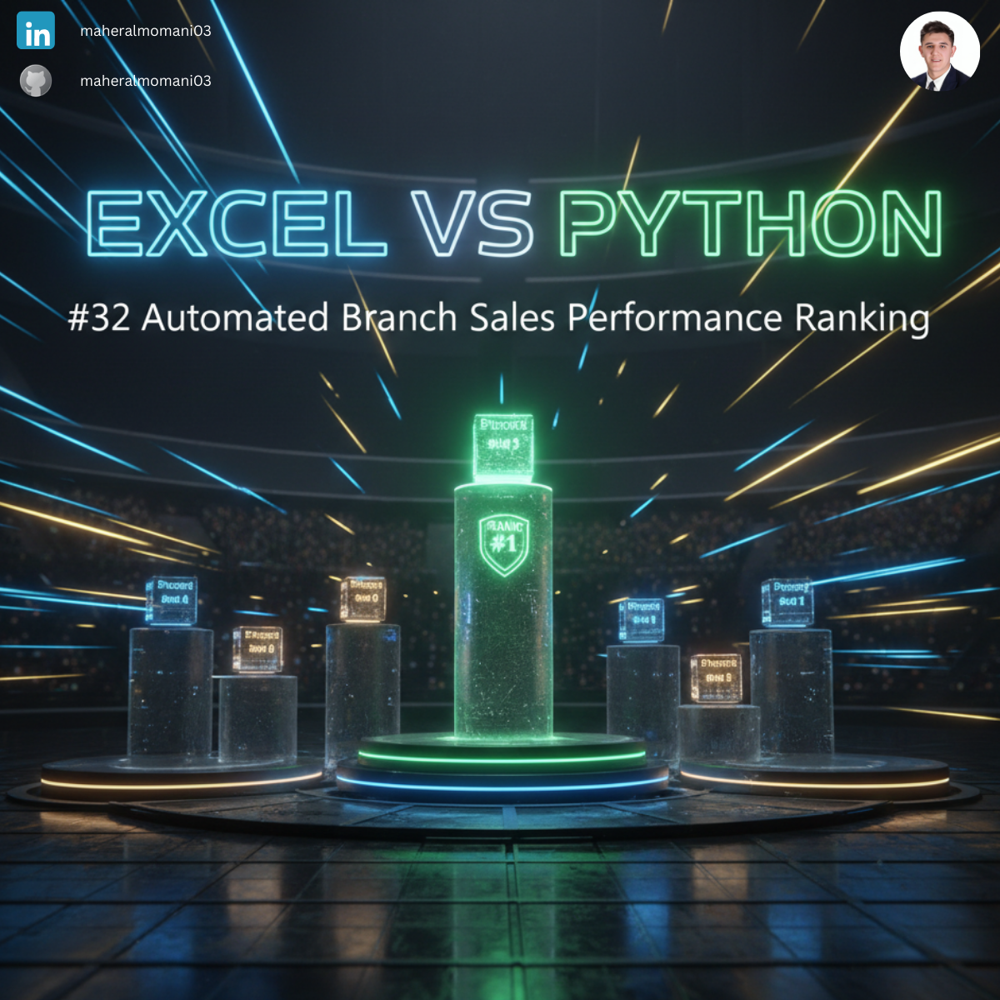
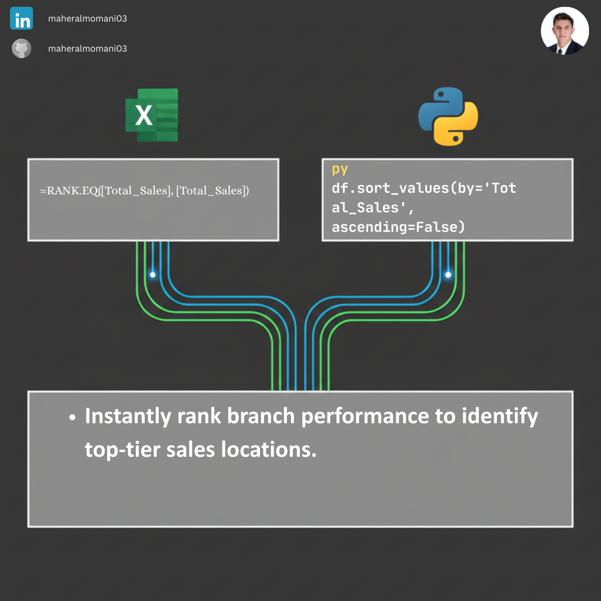

# 🏆 Day 32: Automated Branch Sales Performance Ranking

### 🎯 Objective
Ranking business units or branches based on their sales performance to identify top contributors and areas needing operational improvement.

### 💼 Accounting Context
* **Benchmarking:** Comparing internal units against each other to drive performance improvements.
* **Incentive Planning:** Providing a fair basis for performance-based bonuses and recognition.

### 📗 Excel Approach
**Formula:** `=RANK.EQ(B2, $B$2:$B$5)`
**Logic:** Assigns a rank number to each branch relative to the entire list.

### 🐍 Python Approach
**Logic:** Using `sort_values` to physically rearrange the data, which is more useful for generating top-N reports or executive dashboards.

### 📊 Visual Reference
