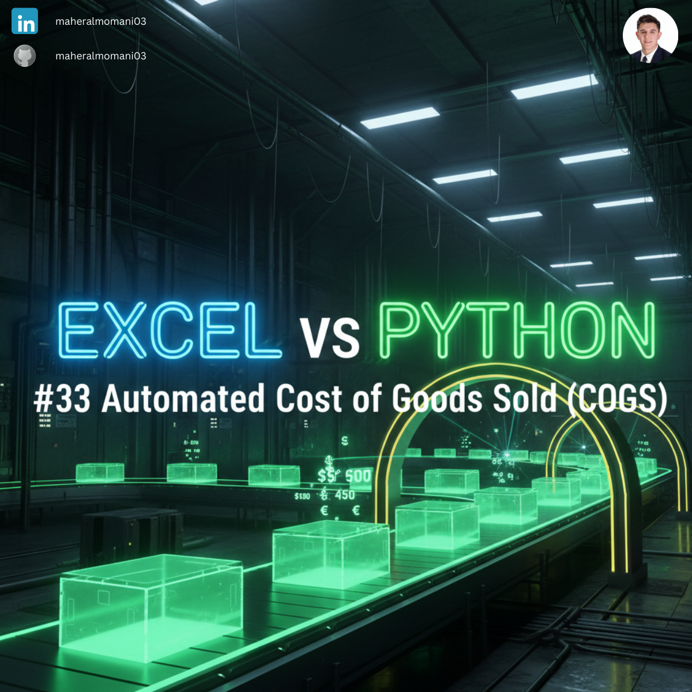
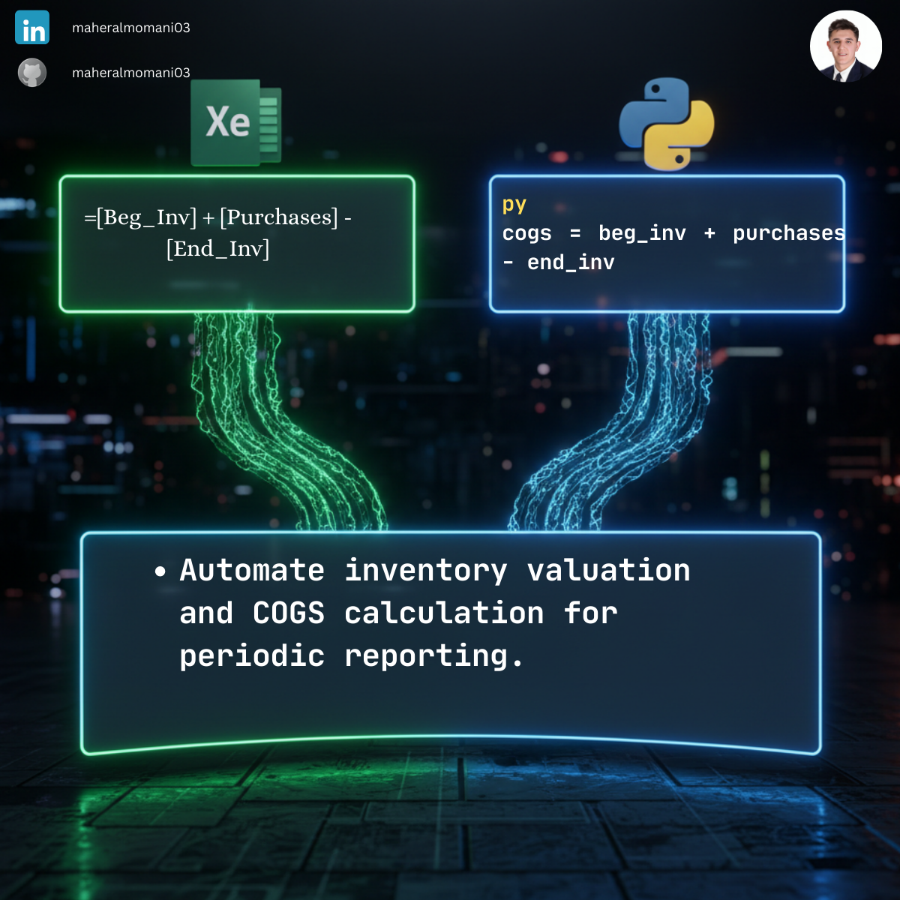

# 🏭 Day 33: Automated Cost of Goods Sold (COGS) Calculation

### 🎯 Objective
Automating the core calculation for determining the direct costs attributable to the production of the goods sold by a company.

### 💼 Accounting Context
* **Gross Profit Analysis:** COGS is the primary driver of Gross Margin; its accuracy is critical for financial reporting.
* **Inventory Control:** Monitoring inventory levels across the accounting period to ensure valuation accuracy.

### 📗 Excel Approach
**Formula:** `=[@Beg_Inv] + [@Purchases] - [@End_Inv]`
**Logic:** Standard accounting equation within an Excel Table.

### 🐍 Python Approach
**Logic:** Vectorized calculation across entire product categories, which is more robust for high-volume retail or manufacturing audits.

### 📊 Visual Reference
