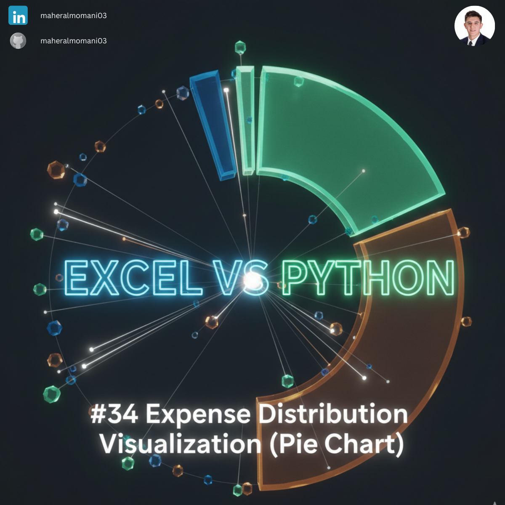
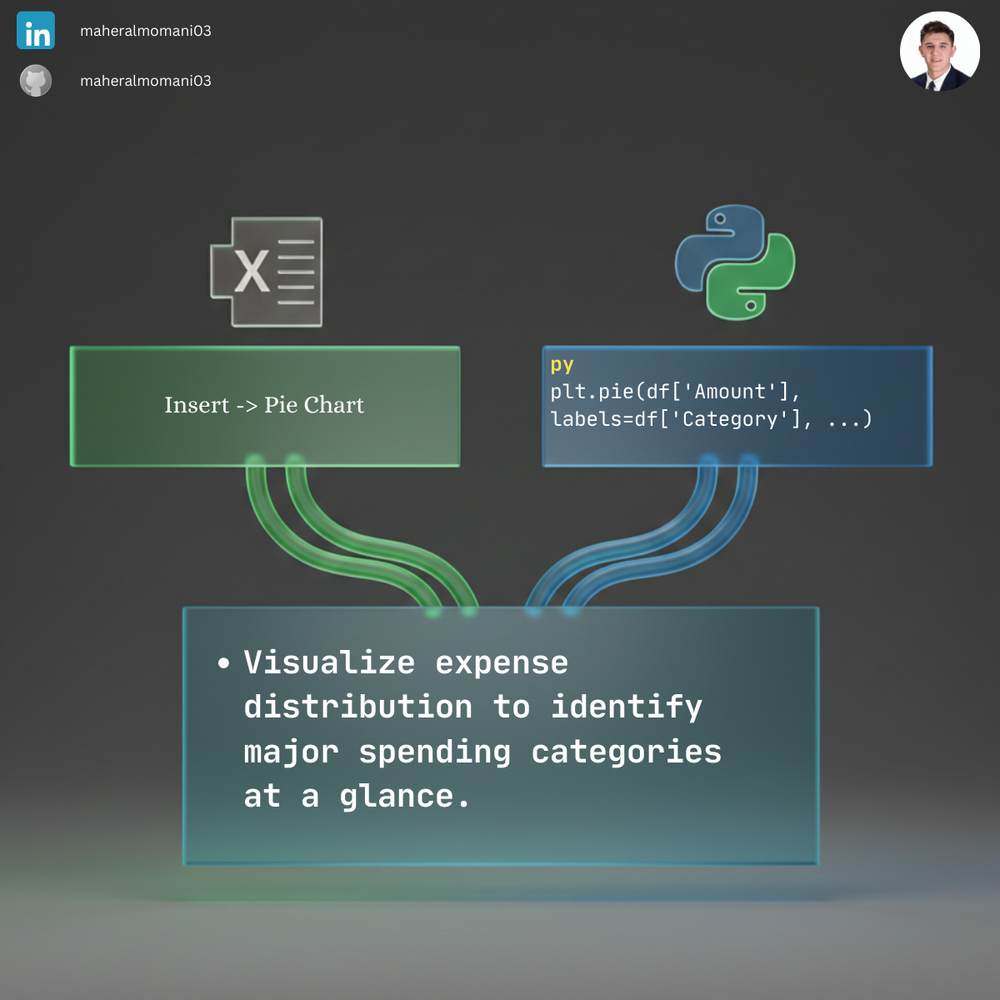

# 🥧 Day 34: Expense Distribution Visualization (Pie Chart)

### 🎯 Objective
Providing a visual representation of how total expenditure is distributed across different categories, making it easy to spot dominant costs.

### 💼 Accounting Context
* **Cost Management:** Visually communicating the "Big Rocks" in a company's spending to management.
* **Budget Variance Reporting:** Comparing planned vs. actual distribution to identify shifts in spending behavior.

### 📗 Excel Approach
**Tool:** Insert > Pie Chart.
**Logic:** Standard visualization tool with manual formatting options.

### 🐍 Python Approach
**Logic:** Using `matplotlib` to generate programmatic charts that can be automatically updated and exported for weekly financial decks.

### 📊 Visual Reference
