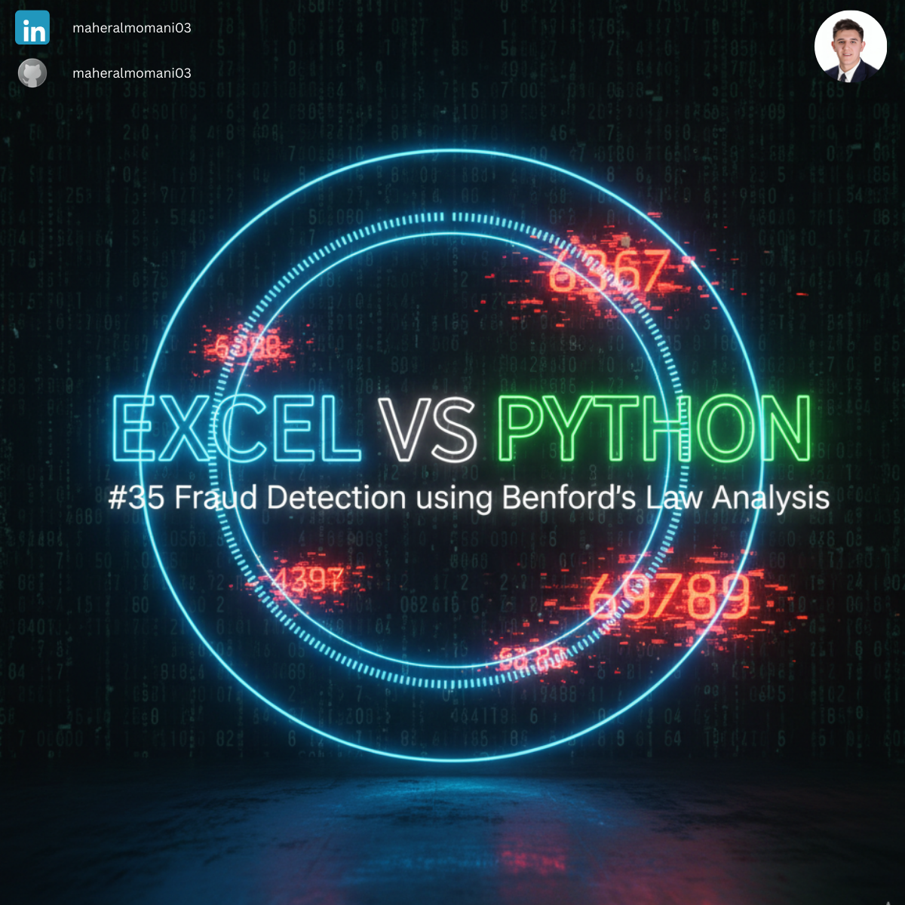
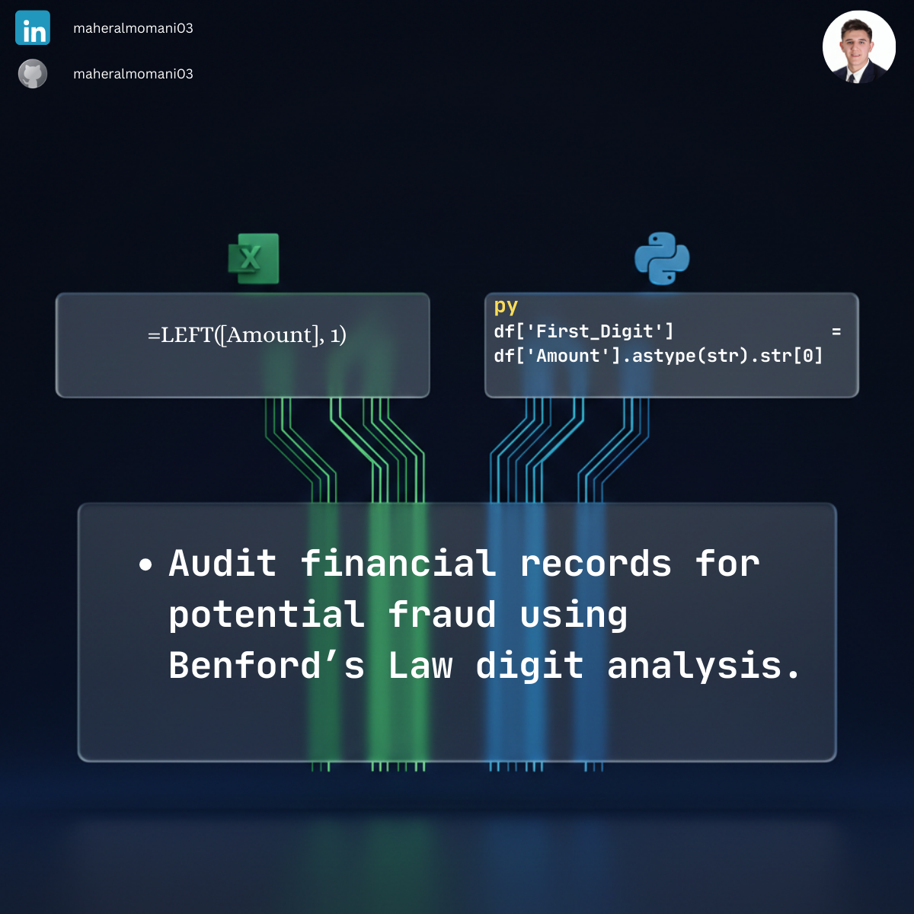

# 🕵️‍♂️ Day 35: Fraud Detection using Benford's Law Analysis

### 🎯 Objective
Applying Benford's Law—a mathematical principle stating that in many naturally occurring sets of numerical data, the leading digit is likely to be small—to detect anomalies and potential fraud in financial records.

### 💼 Accounting Context
* **Forensic Auditing:** Identifying transactions that deviate from expected statistical patterns, which often points to manual manipulation or fictional invoices.
* **Internal Audit Proactive Monitoring:** A high-level screening tool used by auditors to flag high-risk areas for detailed testing.

### 📗 Excel Approach
**Formula:** `=LEFT(A2, 1)` followed by a Pivot Table.
**Logic:** Manual extraction and aggregation of leading digits.

### 🐍 Python Approach
**Logic:** Extracts the first digit and generates the frequency distribution in a single, efficient step, making it perfect for screening millions of rows during a forensic audit.

### 📊 Visual Reference
