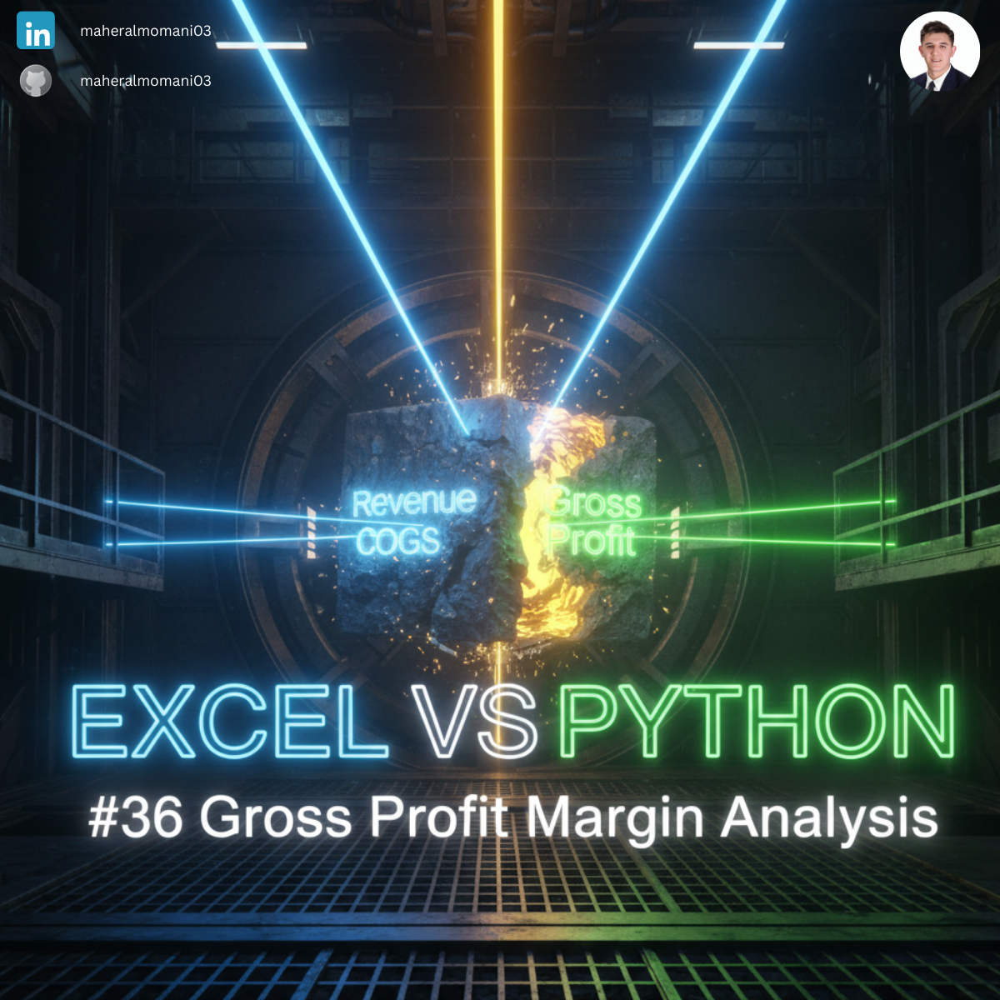
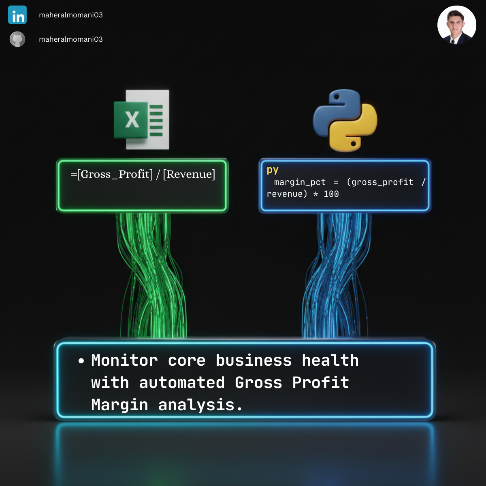

# 📊 Day 36: Gross Profit Margin Analysis

### 🎯 Objective
Evaluating the financial health of a company by calculating the percentage of revenue that exceeds the cost of goods sold. This metric indicates how efficiently a company manages its production costs.

### 💼 Accounting Context
* **Profitability Metric:** One of the most important ratios for comparing performance across industry peers.
* **Cost Control:** Identifying periods where production costs rose faster than sales prices.
* **Pricing Strategy:** Helping management determine if price increases are necessary to maintain target margins.

### 📗 Excel Approach
**Formula:**
`=Margin_Table[@Gross_Profit] / Margin_Table[@Revenue]` (Formatted as %)

### 🐍 Python Approach
**Logic:**
Automated calculation across multiple reporting periods, enabling quick trend analysis without manual formatting.

### 📊 Visual Reference
