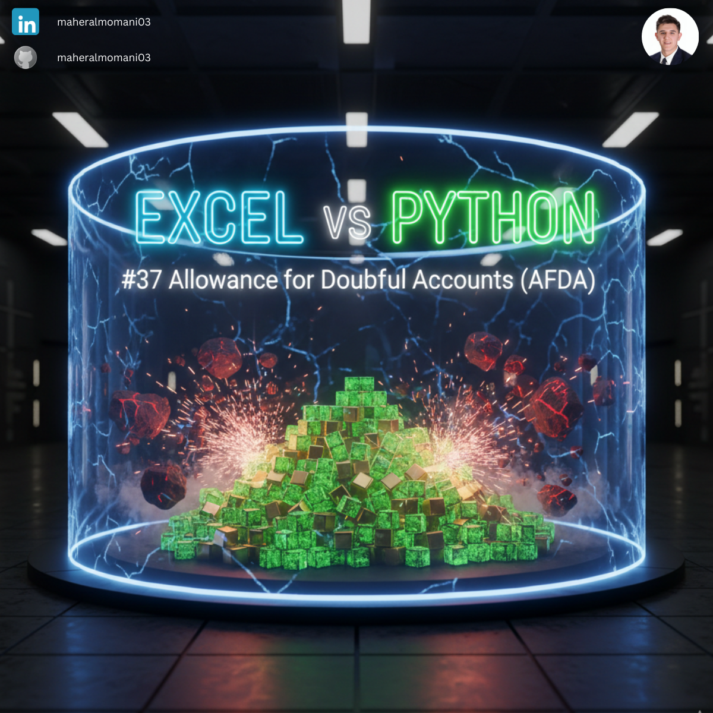
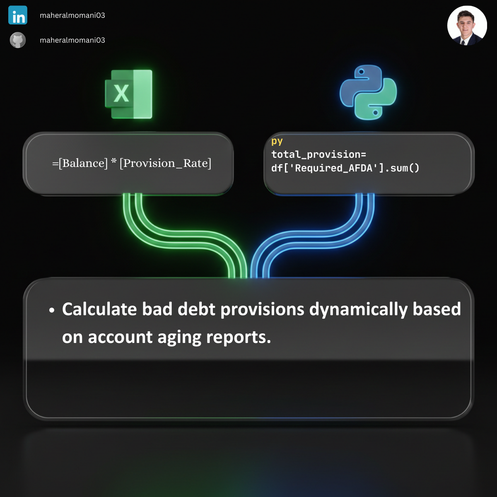

# 🛡️ Day 37: Allowance for Doubtful Accounts (AFDA)

### 🎯 Objective
Estimating the portion of accounts receivable that is expected to be uncollectible. This ensures that assets are not overstated on the balance sheet according to the matching principle.

### 💼 Accounting Context
* **Matching Principle:** Recognizing bad debt expense in the same period as the related revenue.
* **Valuation:** Ensuring Accounts Receivable are reported at their Net Realizable Value (NRV).
* **CMA Core Concept:** Vital for understanding asset valuation and conservative accounting practices.

### 📗 Excel Approach
**Formula:**
`=AFDA_Table[@Balance] * AFDA_Table[@Provision_Rate]`

### 🐍 Python Approach
**Logic:**
Programmatically calculating the reserve needed across different risk buckets and summing the total for a final journal entry recommendation.

### 📊 Visual Reference
