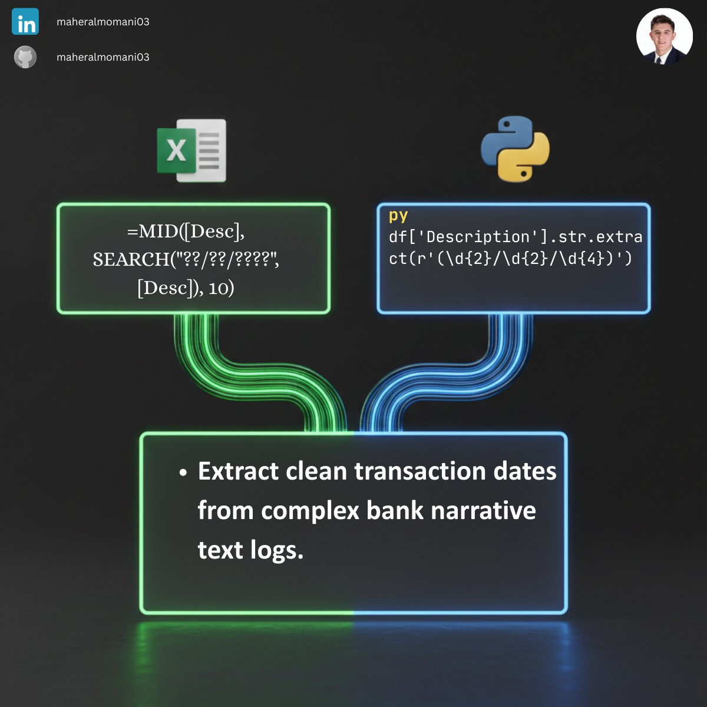

# 📅 Day 38: Extracting Transaction Dates from Bank Narratives

### 🎯 Objective
Automatically extracting structured dates from unstructured bank transaction descriptions (narratives). This process is vital for accurate aging analysis and streamlining bank reconciliations.

### 💼 Accounting Context
* **Audit Trail:** Ensuring bank dates match ledger entries to identify timing differences.
* **Reconciliation Efficiency:** Rapidly converting messy bank logs into chronological data for faster period-end closing.
* **Data Cleansing:** Standardizing free-text fields into valid date formats for automated financial modeling.

### 📗 Excel Approach
**Formula:**
`=IFERROR(MID([@Desc], SEARCH("/", [@Desc]) - 2, 10), "No Date Found")`

**Logic:**
Locates the first slash `/` within the text string and extracts a 10-character substring (encompassing the full date) starting two positions prior.

### 🐍 Python Approach
**Logic:**
* **RegEx Power:** Employs the pattern `(\d{2}/\d{2}/\d{4})` to specifically identify date sequences, offering higher reliability than simple string position searches.
* **Scalability:** Unlike manual Excel formulas, this Python script remains robust even if the text narrative structure varies between different banking institutions.

### 📊 Visual Reference
