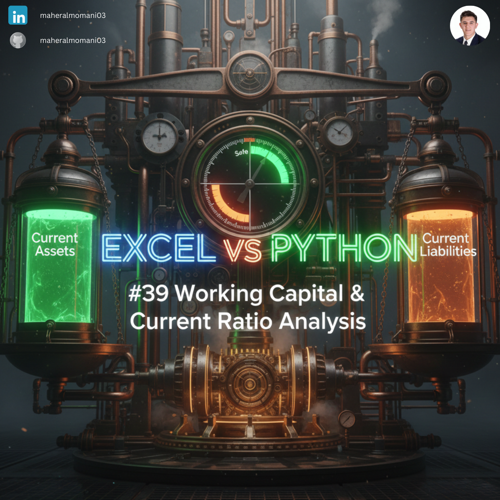
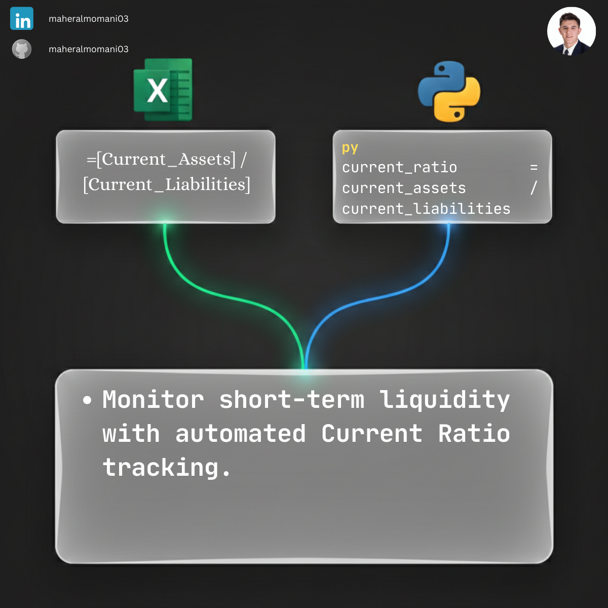

# 💧 Day 39: Working Capital & Current Ratio Analysis

### 🎯 Objective
Measuring a company's ability to pay its short-term obligations with its short-term assets. This ratio is a primary indicator of liquidity and financial stability.

### 💼 Accounting Context
* **Liquidity Analysis:** A ratio above 1.0 suggests the company can cover its immediate debts.
* **Working Capital Management:** Monitoring the efficiency of cash, receivables, and payables cycles.
* **Credit Analysis:** Frequently used by lenders to assess the risk of short-term default.

### 📗 Excel Approach
**Formula:**
`=Liquidity_Table[@Current_Assets] / Liquidity_Table[@Current_Liabilities]`

### 🐍 Python Approach
**Logic:**
Scaling ratio calculations across multiple subsidiaries or branches to provide a consolidated view of organizational liquidity.

### 📊 Visual Reference
