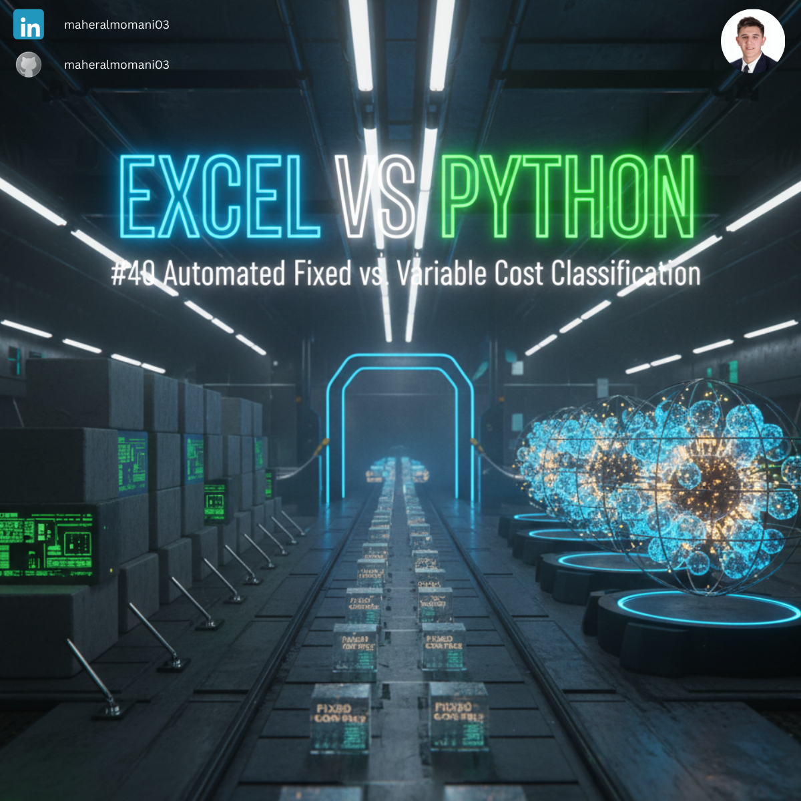
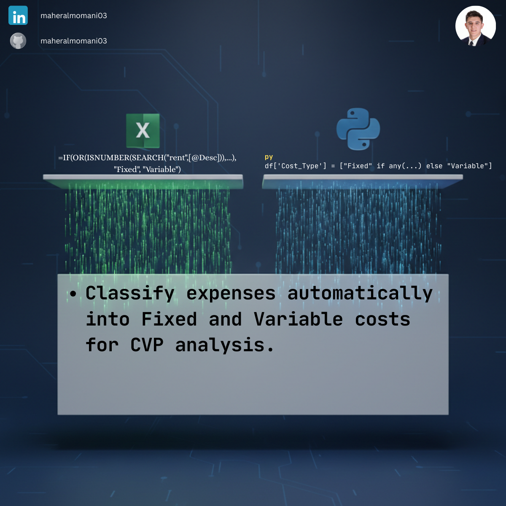

# 🏷️ Day 40: Automated Fixed vs. Variable Cost Classification

### 🎯 Objective
Automatically classifying expenses into "Fixed" or "Variable" categories based on text descriptions. This classification is the foundation for CVP and break-even analysis.

### 💼 Accounting Context
* **Cost Behavior:** Understanding how costs change in relation to activity levels.
* **Managerial Decision Making:** Identifying which costs can be avoided in the short term vs. those that are committed.
* **CMA Topic:** Essential for budgeting and performance evaluation modules.

### 📗 Excel Approach
**Formula:**
`=IF(OR(ISNUMBER(SEARCH("rent",[@Desc])), ISNUMBER(SEARCH("lease",[@Desc]))), "Fixed", "Variable")`

### 🐍 Python Approach
**Logic:**
Using Python's list comprehension and string matching to handle complex classification rules much more cleanly than nested Excel IF statements.

### 📊 Visual Reference
