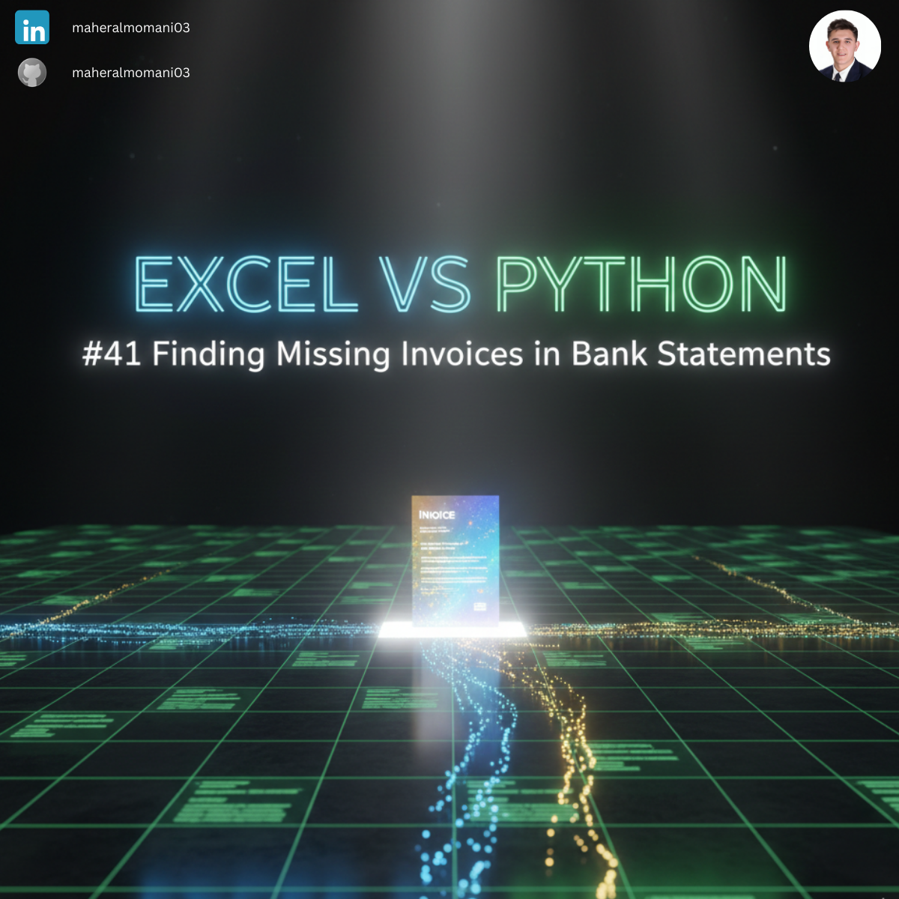
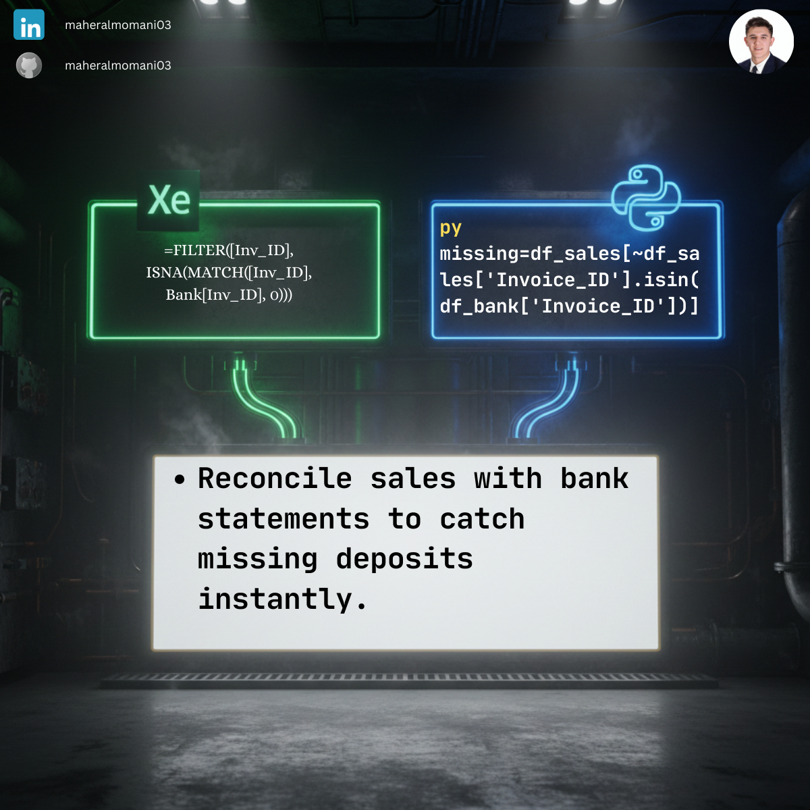

# 🔍 Day 41: Finding Missing Invoices (Bank vs. Sales)

### 🎯 Objective
Automating the reconciliation process to identify sales invoices that have been recorded in the system but have no corresponding entry in the bank statement.

### 💼 Accounting Context
* **Bank Reconciliation:** Essential for identifying uncollected revenue or timing differences.
* **Internal Control:** Ensuring all sales transactions are followed by a cash inflow.
* **Audit Readiness:** Providing a clear list of missing bank entries for month-end adjustments.

### 📗 Excel Approach
**Formula:** `=FILTER(Sales_Data[Inv_ID], ISNA(MATCH(Sales_Data[Inv_ID], Bank_Statement[Bank_ID], 0)))`

### 🐍 Python Approach
**Logic:** Uses the `.isin()` method with a negation (`~`) to instantly filter for IDs that exist in the Sales table but are absent in the Bank table.

### 📊 Visual Reference
