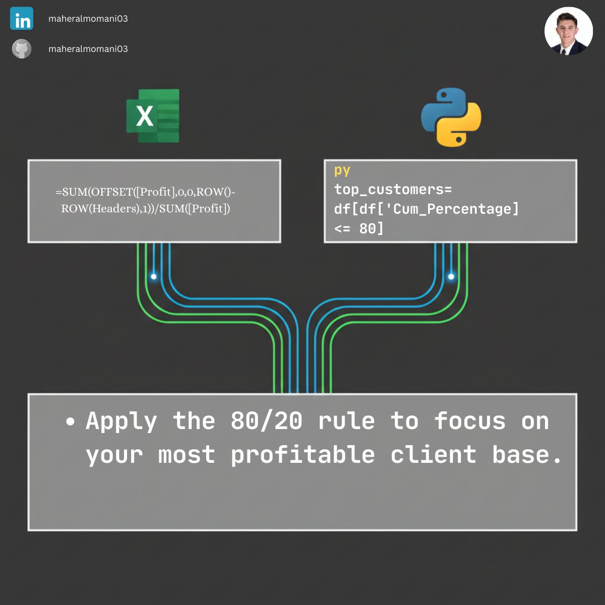

# 📈 Day 42: Pareto 80/20 Profit Analysis (Top Customers)

### 🎯 Objective
Applying the Pareto Principle to identify the top 20% of customers who typically generate 80% of the company's total profit.

### 💼 Accounting Context
* **Managerial Analysis:** Focuses marketing and retention efforts on the most profitable segments.
* **CMA Strategy:** A key part of strategic cost management and customer profitability analysis.

### 📗 Excel Approach
**Formula:** `=SUM($B$2:B2) / SUM(Pareto_Table[Profit])`
**Logic:** Calculating a running total divided by the grand total.

### 🐍 Python Approach
**Logic:** Uses `.cumsum()` for an automated running total and dynamic filtering for the 80% threshold.

### 📊 Visual Reference
