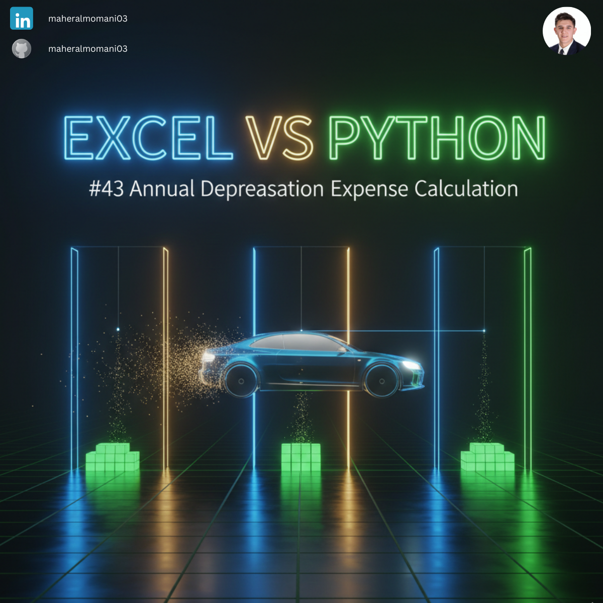
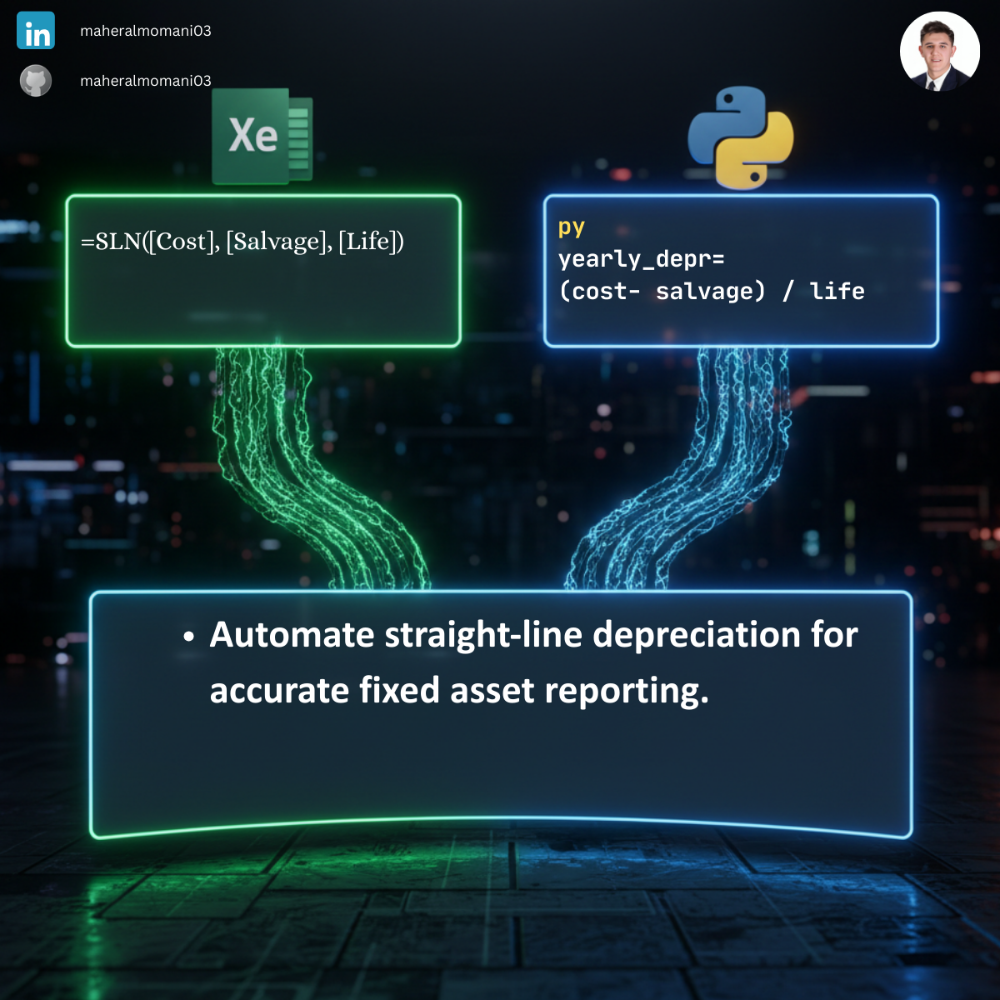

# 🏚️ Day 43: Annual Depreciation Expense Calculation

### 🎯 Objective
Automating the calculation of annual depreciation expense for fixed assets using the straight-line method.

### 💼 Accounting Context
* **Asset Valuation:** Ensuring fixed assets are reported at net book value.
* **Period Closing:** Rapid calculation for journalizing monthly or yearly depreciation entries.
* **CMA Topic:** Fundamental part of financial statement preparation and long-term asset management.

### 📗 Excel Approach
**Formula:** `=SLN(Depreciation_Table[@Cost], Depreciation_Table[@Salvage], Depreciation_Table[@Life])`

### 🐍 Python Approach
**Logic:** Implements the core accounting formula across the entire asset register simultaneously.

### 📊 Visual Reference
