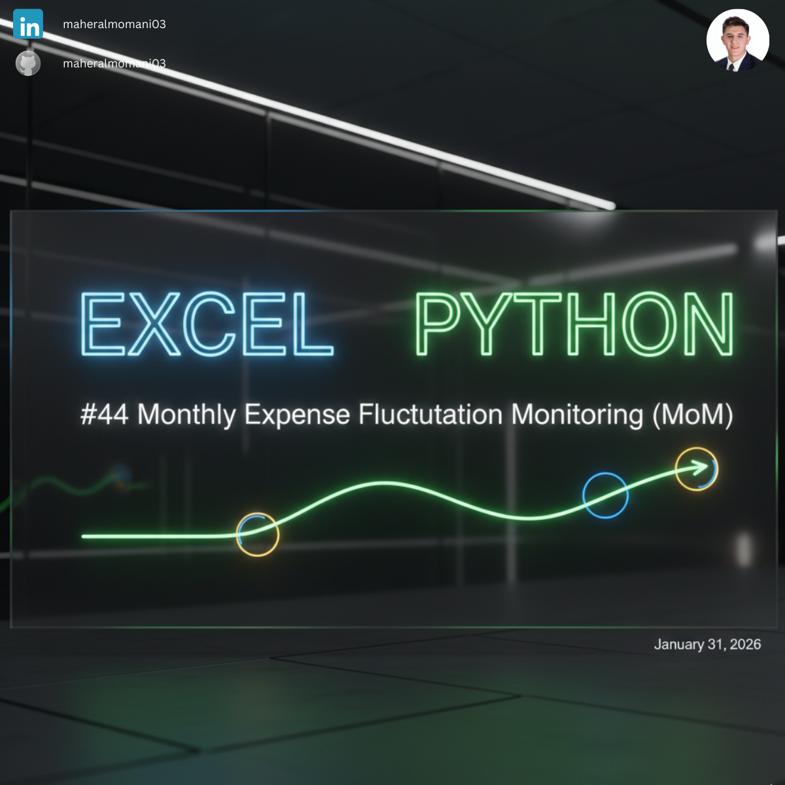
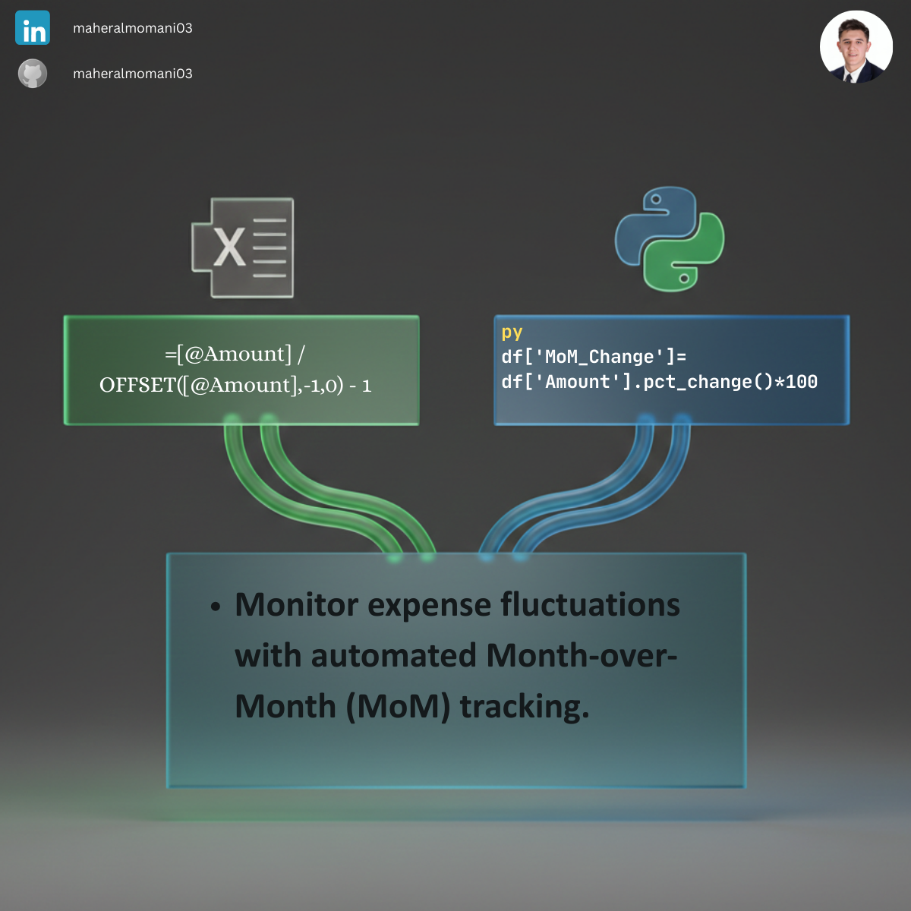

# 📉 Day 44: Monthly Expense Fluctuation Monitoring (MoM)

### 🎯 Objective
Monitoring the percentage change in expenses between consecutive months to detect unusual spending spikes or cost-saving trends.

### 💼 Accounting Context
* **Variance Analysis:** A core requirement for budget monitoring and reporting.
* **Internal Control:** Identifying significant fluctuations that require investigation or management explanation.
* **Trend Analysis:** Visualizing cost trajectories over time.

### 📗 Excel Approach
**Formula:** `=MoM_Table[@Amount]/ OFFSET(MoM_Table[@Amount],-1,0) - 1`

### 🐍 Python Approach
**Logic:** Uses `.pct_change()` to instantly calculate growth rates across the time series.

### 📊 Visual Reference
