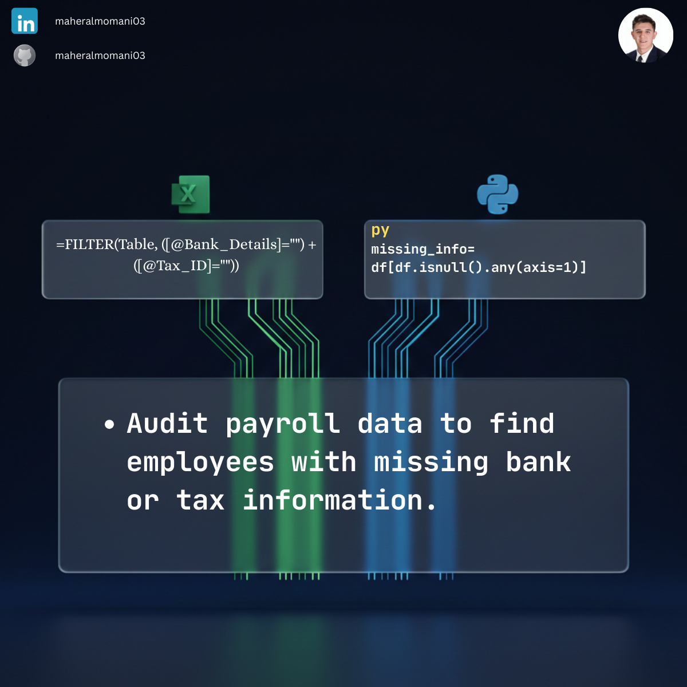

# 👥 Day 45: Detecting Missing Bank or Tax Info in Payroll

### 🎯 Objective
Automating payroll audits to identify incomplete employee records that could lead to payment failures or compliance issues.

### 💼 Accounting Context
* **Payroll Accuracy:** Ensuring all employees have valid banking and tax details before the pay run.
* **Compliance Audit:** Verifying that the HR database meets regulatory tax requirements.
* **Data Integrity:** Keeping clean master data for internal reporting.

### 📗 Excel Approach
**Formula:** `=FILTER(Payroll_Table, (Payroll_Table[Bank_Details]="") + (Payroll_Table[Tax_ID]=""))`

### 🐍 Python Approach
**Logic:** Uses `.isnull().any(axis=1)` to find any row containing a missing value (NaN) across multiple columns.

### 📊 Visual Reference
