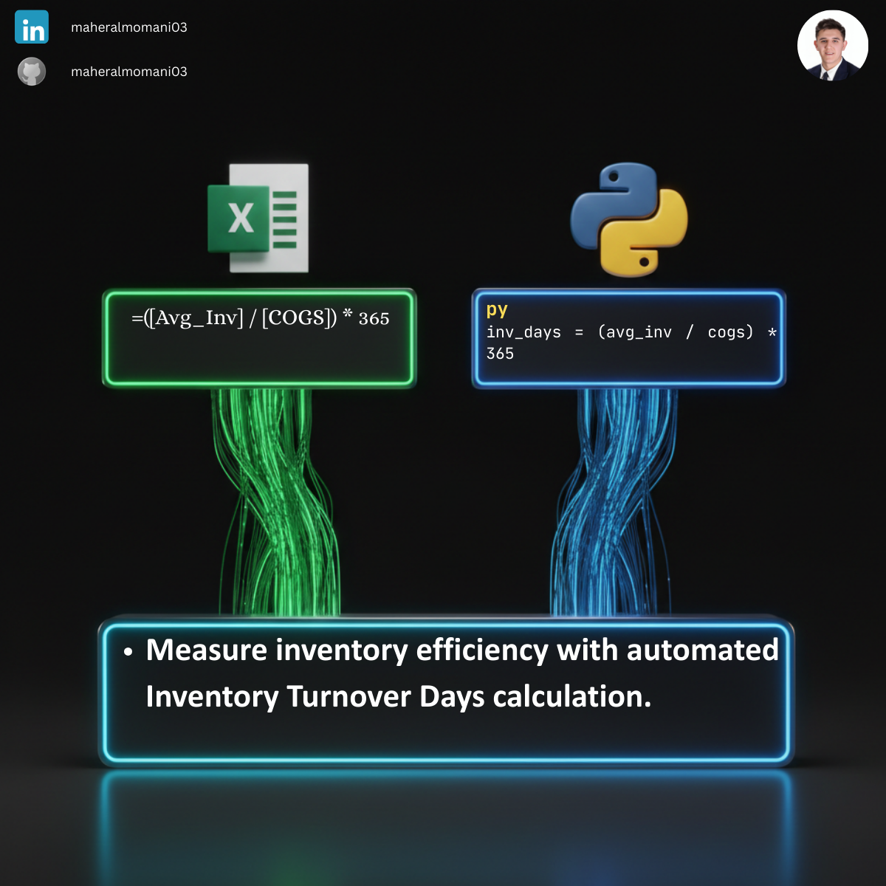

# 📦 Day 46: Calculating Inventory Turnover in Days

### 🎯 Objective
Measuring the average number of days a company holds its inventory before selling it. This metric is a key indicator of supply chain efficiency and liquidity.

### 💼 Accounting Context
* **CMA Performance Metric:** A critical part of "Working Capital Management" and "Ratio Analysis."
* **Liquidity Analysis:** Shorter turnover days generally indicate high efficiency, while longer days may suggest overstocking or obsolete inventory.
* **Cash Flow Impact:** Directly affects the cash conversion cycle.

### 📗 Excel Approach
**Formula:** `=(Inventory_Table[@Avg_Inv] / Inventory_Table[@COGS]) * 365`

### 🐍 Python Approach
**Logic:** Automated calculation across entire product lines, facilitating rapid trend analysis for inventory managers without manual cell dragging.

### 📊 Visual Reference
