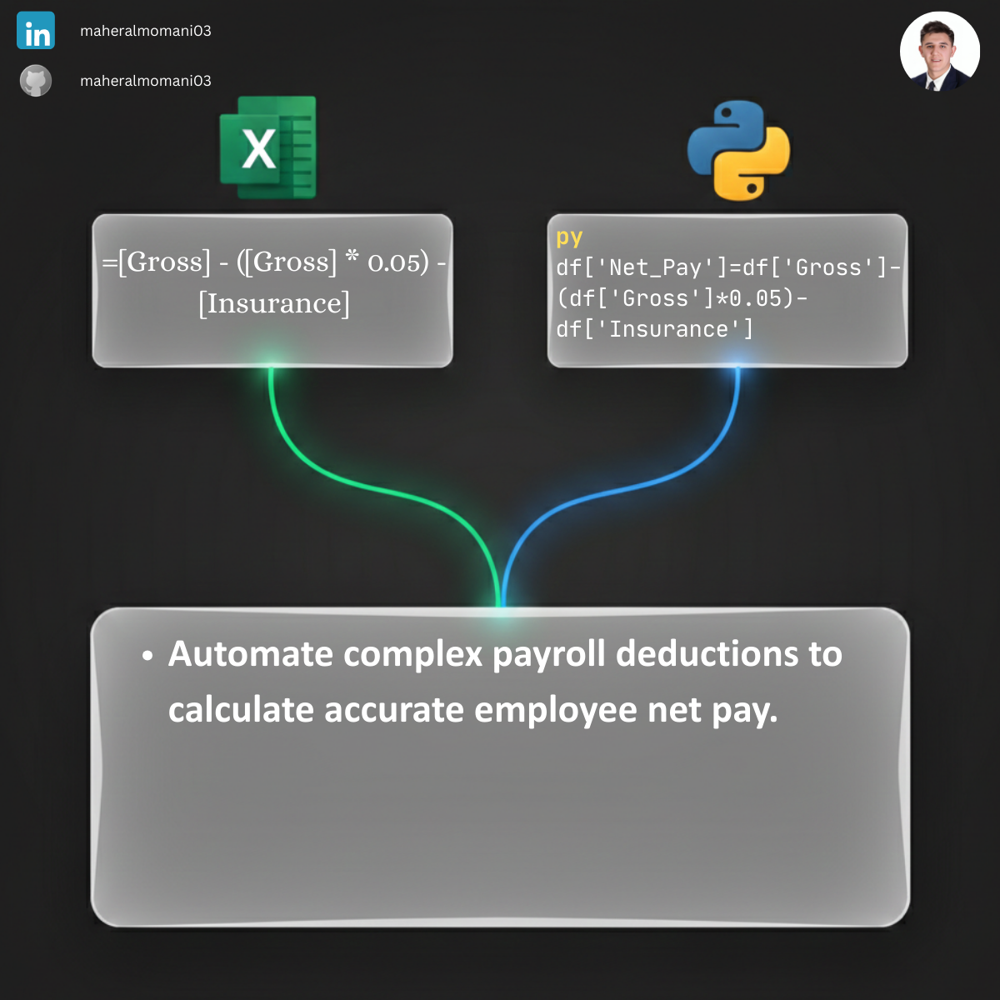

# 👷 Day 49: Automated Employee Net Pay Calculation

### 🎯 Objective
Automating the calculation of employee take-home pay by programmatically deducting social security taxes and insurance premiums from gross earnings.

### 💼 Accounting Context
* **Operational Control:** Ensuring payroll accuracy and reducing manual data entry errors in sensitive financial files.
* **Compliance Audit:** Verifying that statutory deductions (like 5% Social Security) are correctly applied to all employee tiers.
* **Internal Reporting:** Generating clean, ready-to-pay lists for bank transfers.

### 📗 Excel Approach
**Formula:** `=Payroll_Calculation[@Gross] - (Payroll_Calculation[@Gross] * 0.05) - Payroll_Calculation[@Insurance]`

### 🐍 Python Approach
**Logic:** Mass calculation across the entire workforce instantly, ensuring that complex multi-tier deduction rules remain consistent for every employee record.

### 📊 Visual Reference
