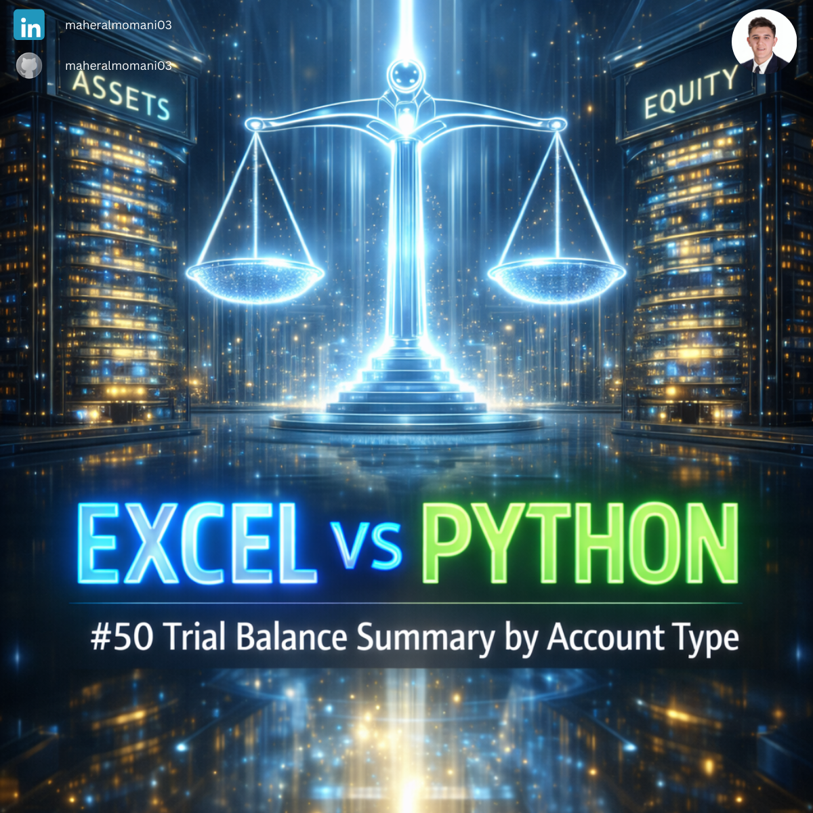

# ⚖️ Day 50: Trial Balance Summary by Account Type

### 🎯 Objective
Summarizing a detailed Trial Balance into high-level categories (Assets, Liabilities, Equity) to facilitate the preparation of financial statements.

### 💼 Accounting Context
* **Financial Reporting:** A fundamental step in the accounting cycle before producing the Balance Sheet and Income Statement.
* **Audit Verification:** Ensuring that the total of Assets equals the sum of Liabilities and Equity at the category level.
* **CMA Core Knowledge:** Essential for understanding financial statement structure and internal reporting hierarchies.

### 📗 Excel Approach
**Formula:** `=SUMIFS(Trial_Balance[Balance], Trial_Balance[Account_Type], "Assets")`

### 🐍 Python Approach
**Logic:** Using `groupby` to instantly aggregate all account types in one step, providing a flexible summary that automatically updates as new accounts are added.

### 📊 Visual Reference
