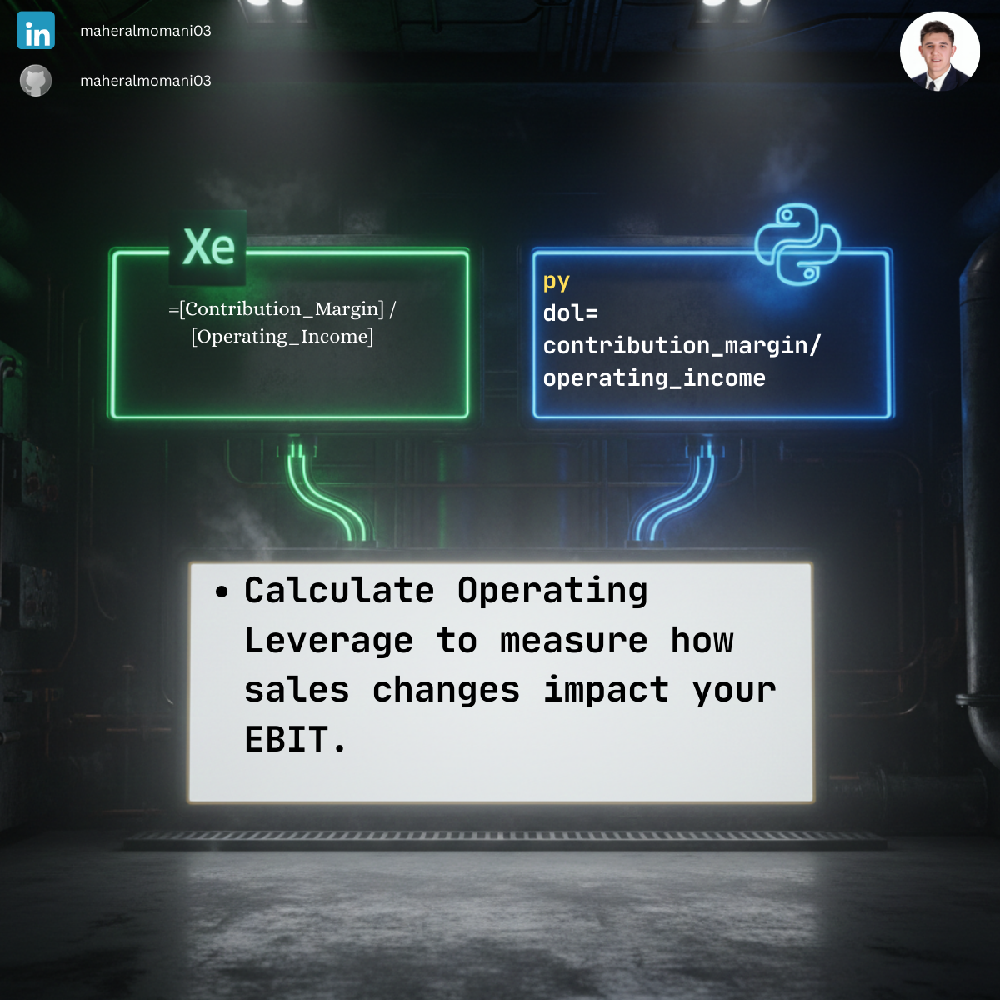

# 📈 Day 51: Degree of Operating Leverage (DOL) Analysis

### 🎯 Objective
Measuring how sensitive a company's operating income is to its sales volume. High DOL indicates that a small change in sales will result in a large change in operating income, reflecting higher operational risk.

### 💼 Accounting Context
* **Risk Assessment:** Understanding the company's cost structure (Fixed vs. Variable).
* **CMA Core Topic:** Fundamental to "CVP Analysis" and "Risk Management" modules.
* **Scenario Planning:** Predicting profit fluctuations during economic downturns or booms.

### 📗 Excel Approach
**Formula:** `=DOL_Analysis[@Contribution_Margin] / DOL_Analysis[@Operating_Income]`

### 🐍 Python Approach
**Logic:** Scalable leverage calculation across multiple business units or subsidiaries to identify which segments are most exposed to sales volatility.

### 📊 Visual Reference
