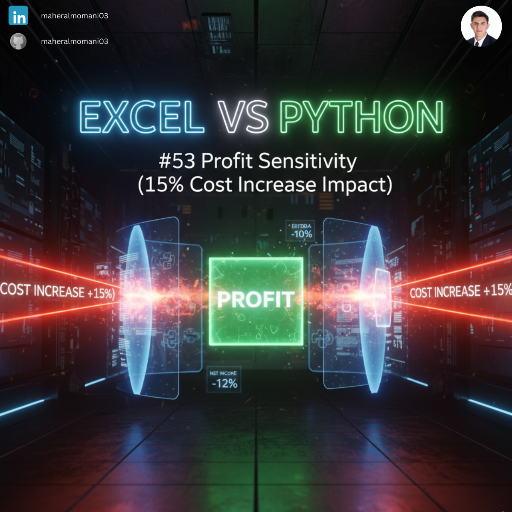
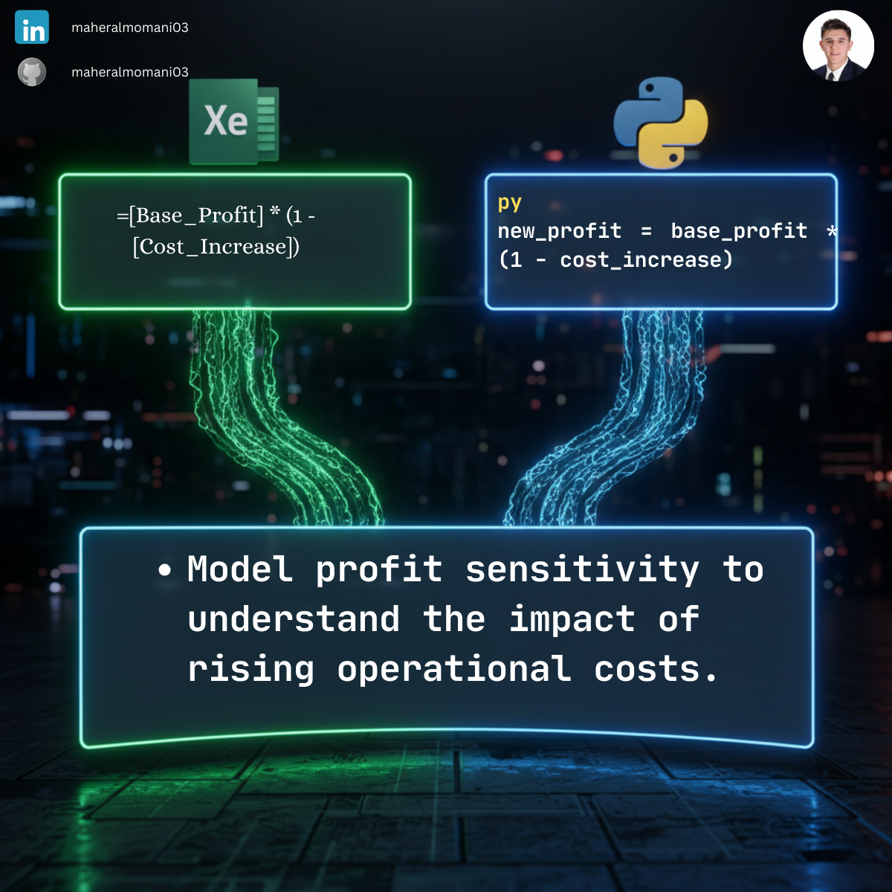

# 📉 Day 53: Profit Sensitivity (15% Cost Increase Impact)

### 🎯 Objective
Analyzing how a specific percentage increase in costs (e.g., due to inflation or supply chain disruptions) impacts the bottom-line profit.

### 💼 Accounting Context
* **Budgeting & Forecasting:** Essential for stress-testing financial plans against adverse economic conditions.
* **CMA Decision Analysis:** Identifying the "Margin of Safety" before a project becomes unprofitable.
* **Pricing Strategy:** Helping management decide if cost increases must be passed on to customers.

### 📗 Excel Approach
**Formula:** `=Sensitivity_Table[@Base_Profit] * (1 - Sensitivity_Table[@Cost_Increase])`

### 🐍 Python Approach
**Logic:** Automating sensitivity scenarios across thousands of SKU-level profit records, which would be cumbersome to manage in standard Excel sheets.

### 📊 Visual Reference
