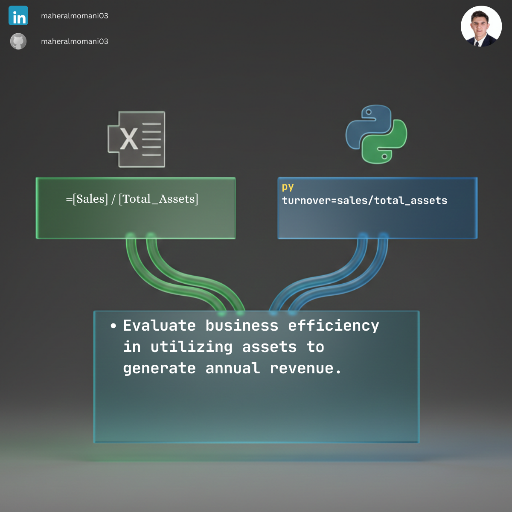

# ⚙️ Day 54: Total Asset Turnover Efficiency Ratio

### 🎯 Objective
Measuring how efficiently a company uses its assets to generate sales revenue. A higher ratio implies more efficient use of the company's asset base.

### 💼 Accounting Context
* **Efficiency Analysis:** A key component of the DuPont Analysis model for evaluating ROE.
* **CMA Ratio Analysis:** Vital for benchmarking operational performance against industry standards.
* **Asset Management:** Identifying underperforming assets that are not contributing to revenue growth.

### 📗 Excel Approach
**Formula:** `=Asset_Turnover_Table[@Sales] / Asset_Turnover_Table[@Total_Assets]`

### 🐍 Python Approach
**Logic:** Programmatic calculation across multiple years or subsidiaries to visualize long-term efficiency trends instantly.

### 📊 Visual Reference
