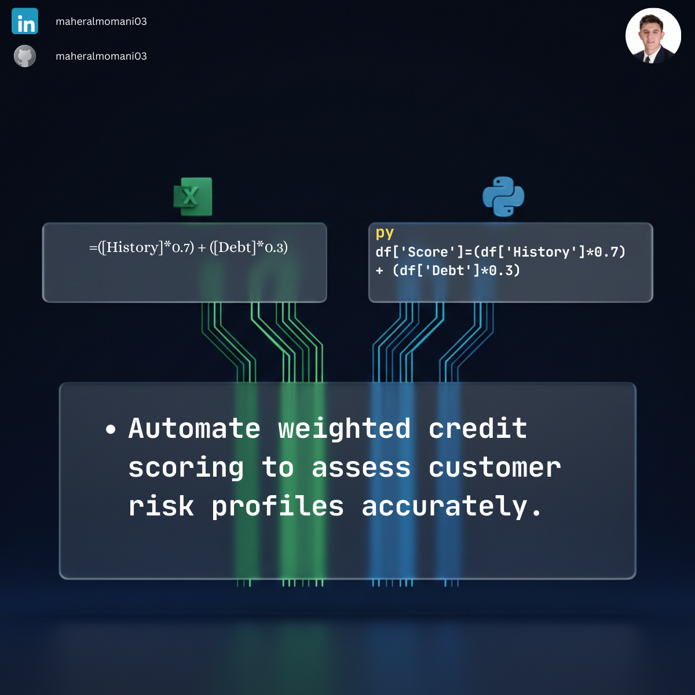

# 💳 Day 55: Automated Client Credit Scoring Model

### 🎯 Objective
Developing a weighted scoring model to assess client creditworthiness, helping the credit department set appropriate credit limits.

### 💼 Accounting Context
* **Accounts Receivable Management:** Reducing bad debt risk by proactively identifying high-risk clients.
* **Credit Policy:** Providing an objective, data-driven basis for approving or rejecting credit applications.
* **Working Capital Optimization:** Ensuring that credit is extended to clients who are statistically more likely to pay on time.

### 📗 Excel Approach
**Formula:** `=(Credit_Score_Table[@History]*0.7) + (Credit_Score_Table[@Debt]*0.3)`

### 🐍 Python Approach
**Logic:** Flexible model that can easily integrate more variables (like industry risk or years in business) without increasing spreadsheet complexity.

### 📊 Visual Reference
