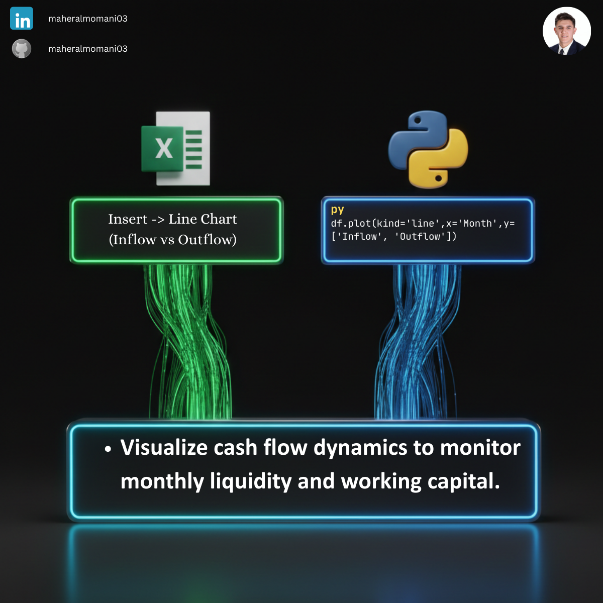

# 🌊 Day 56: Cash Flow Trend Analysis (Inflow vs Outflow)

### 🎯 Objective
Visualizing the historical relationship between cash inflows and outflows to identify seasonal patterns and potential liquidity gaps.

### 💼 Accounting Context
* **Liquidity Planning:** Essential for ensuring the company maintains sufficient cash to meet its obligations.
* **Variance Monitoring:** Identifying periods where outflows significantly exceed inflows for management investigation.
* **CMA Performance Metric:** Key for assessing the quality of earnings and operational sustainability.

### 📗 Excel Approach
**Tool:**
Insert > Line Chart.
**Logic:**
Plots monthly data points to show trajectory changes visually.

### 🐍 Python Approach
**Logic:**
* **`df.plot()`:** Instantly generates multi-variable line charts from structured tables.
* **Automation:** Perfect for generating standardized monthly liquidity reports for executive dashboards.

### 📊 Visual Reference
