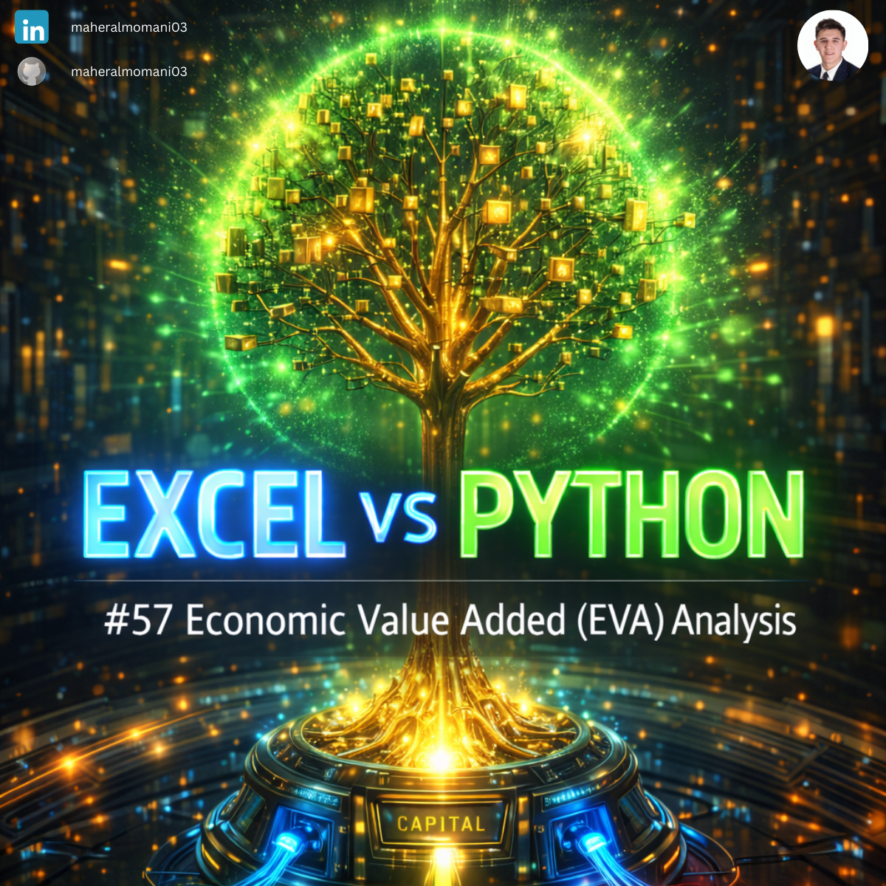
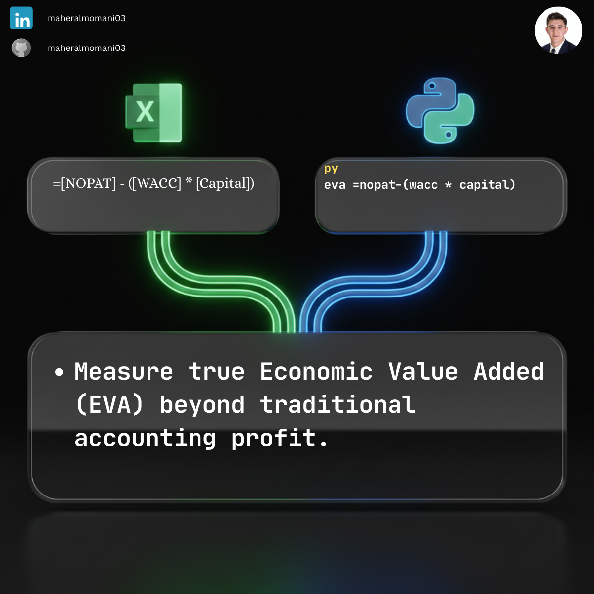

# 💎 Day 57: Economic Value Added (EVA) Analysis

### 🎯 Objective
Measuring a company's financial performance based on the residual wealth calculated by deducting its cost of capital from its operating profit.

### 💼 Accounting Context
* **Value Creation:** Determining if a business unit is truly adding value above its required rate of return.
* **Performance Measurement:** Often used as a basis for executive compensation and strategic resource allocation.
* **CMA Advanced Concept:** A critical part of "Decision Analysis" and "Performance Management" modules.

### 📗 Excel Approach
**Formula:**
`=EVA_Table[@NOPAT] - (EVA_Table[@WACC] * EVA_Table[@Capital])`

### 🐍 Python Approach
**Logic:**
Scaling value-creation analysis across large corporate portfolios to identify which segments are "Value Creators" vs "Value Destroyers."

### 📊 Visual Reference
