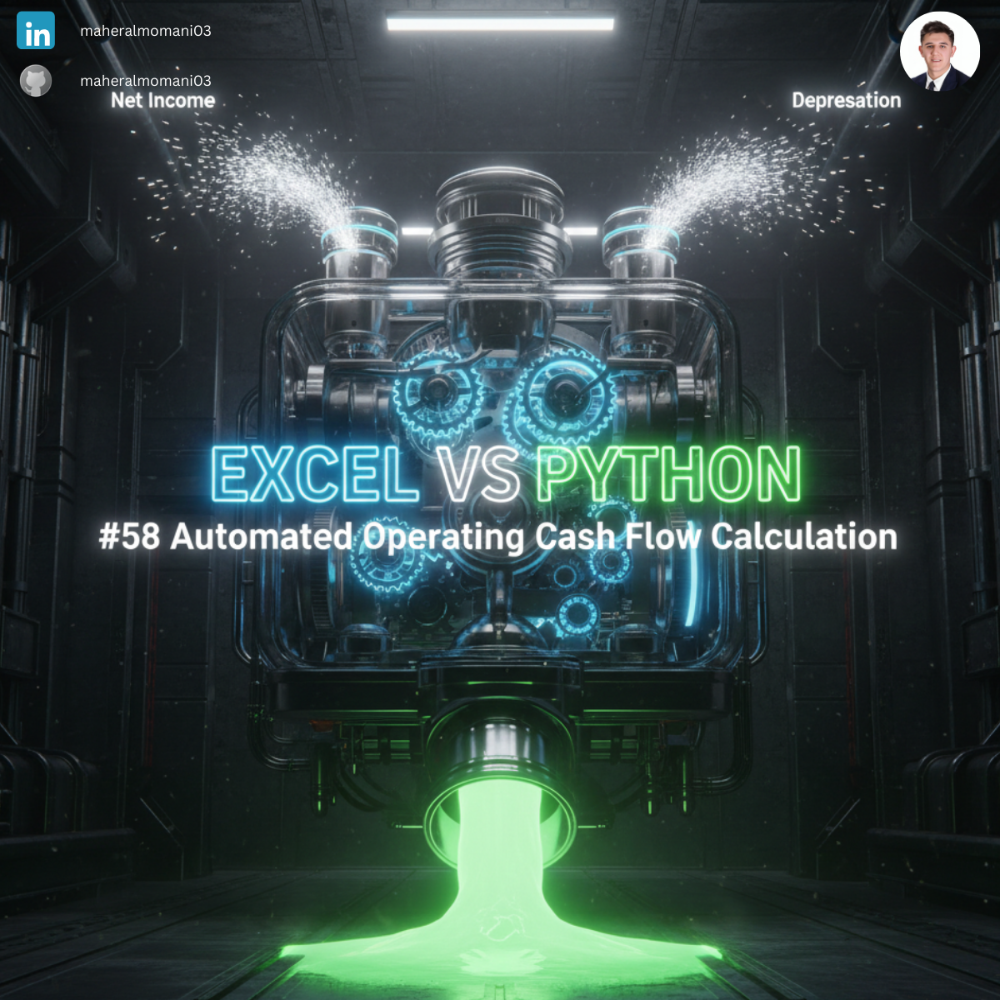
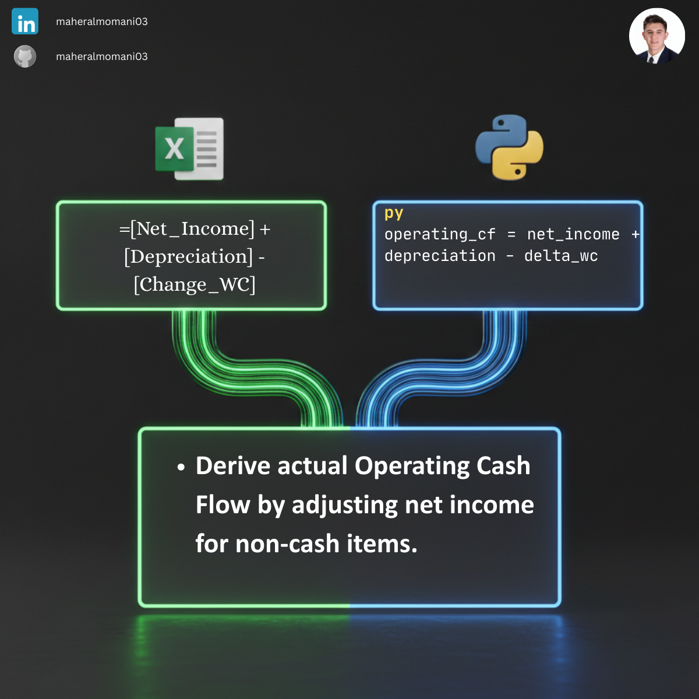

# 💸 Day 58: Automated Operating Cash Flow Calculation

### 🎯 Objective
Automating the conversion of accrual-based Net Income into cash-based Operating Cash Flow (OCF) using the indirect method.

### 💼 Accounting Context
* **Cash Flow Statement:** A core component of external financial reporting.
* **Earnings Quality:** Analyzing the gap between profit and actual cash generated from operations.
* **CMA Core Knowledge:** Essential for understanding the reconciliation between the Income Statement and the Cash Flow Statement.

### 📗 Excel Approach
**Formula:**
`=CashFlow_Table[@Net_Income] + CashFlow_Table[@Depreciation] - CashFlow_Table[@Change_WC]`

### 🐍 Python Approach
**Logic:**
Standardizing the OCF calculation across multiple reporting periods to ensure consistent application of adjustment rules (e.g., handling non-cash items).

### 📊 Visual Reference
