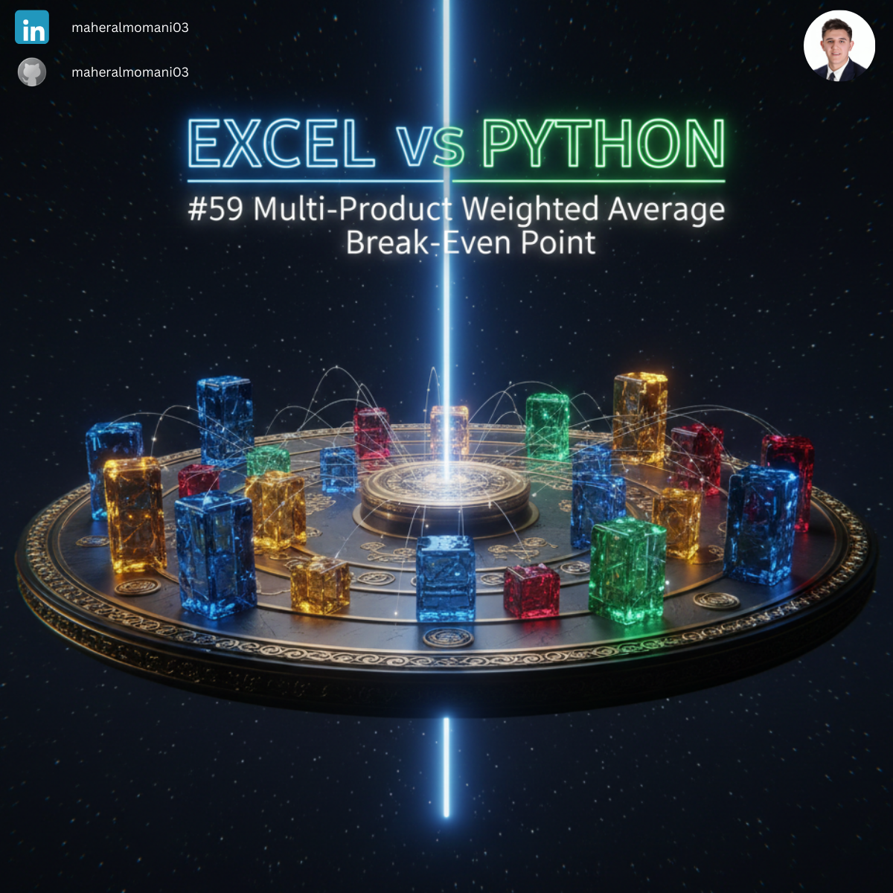
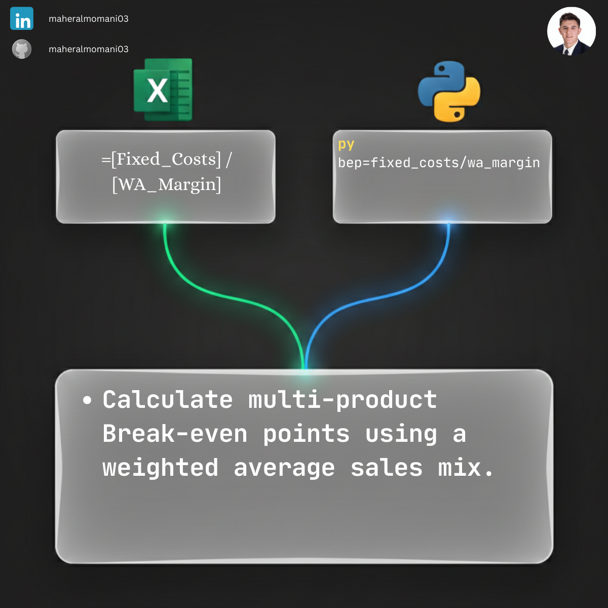

# ⚖️ Day 59: Multi-Product Weighted Average Break-Even Point

### 🎯 Objective
Calculating the sales volume required to break even when a company sells multiple products with different contribution margins (Sales Mix).

### 💼 Accounting Context
* **Sales Mix Analysis:** Understanding how shifts in product popularity impact the company's overall break-even point.
* **Strategic Planning:** Determining the feasibility of new product lines relative to existing fixed overhead.
* **CMA Topic:** Directly related to "Cost Management" and "Budgeting" for multi-product firms.

### 📗 Excel Approach
**Formula:**
`=BEP_Multi_Table[@Fixed_Costs] / BEP_Multi_Table[@WA_Margin]`

### 🐍 Python Approach
**Logic:**
Facilitating "What-if" simulations by adjusting the sales mix percentages instantly to see the impact on organizational risk.

### 📊 Visual Reference
